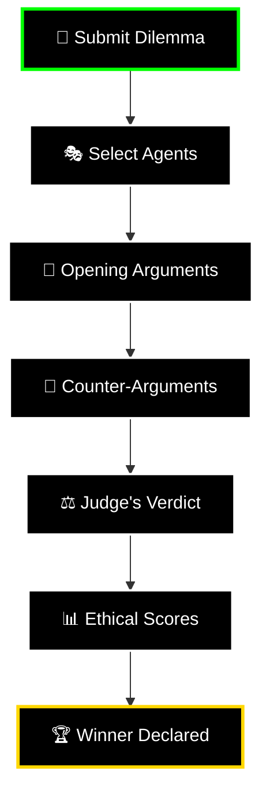
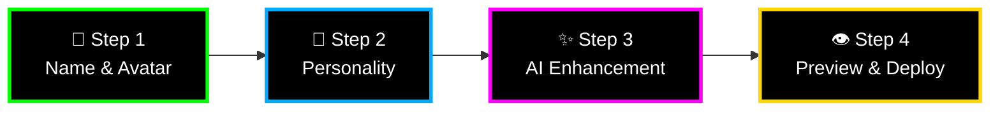
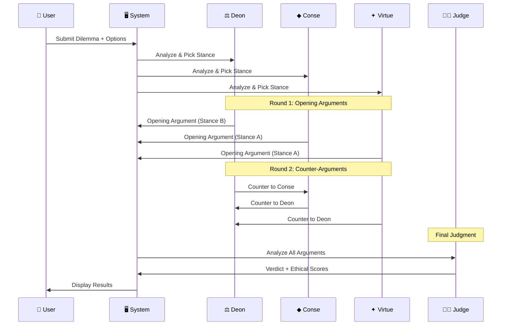
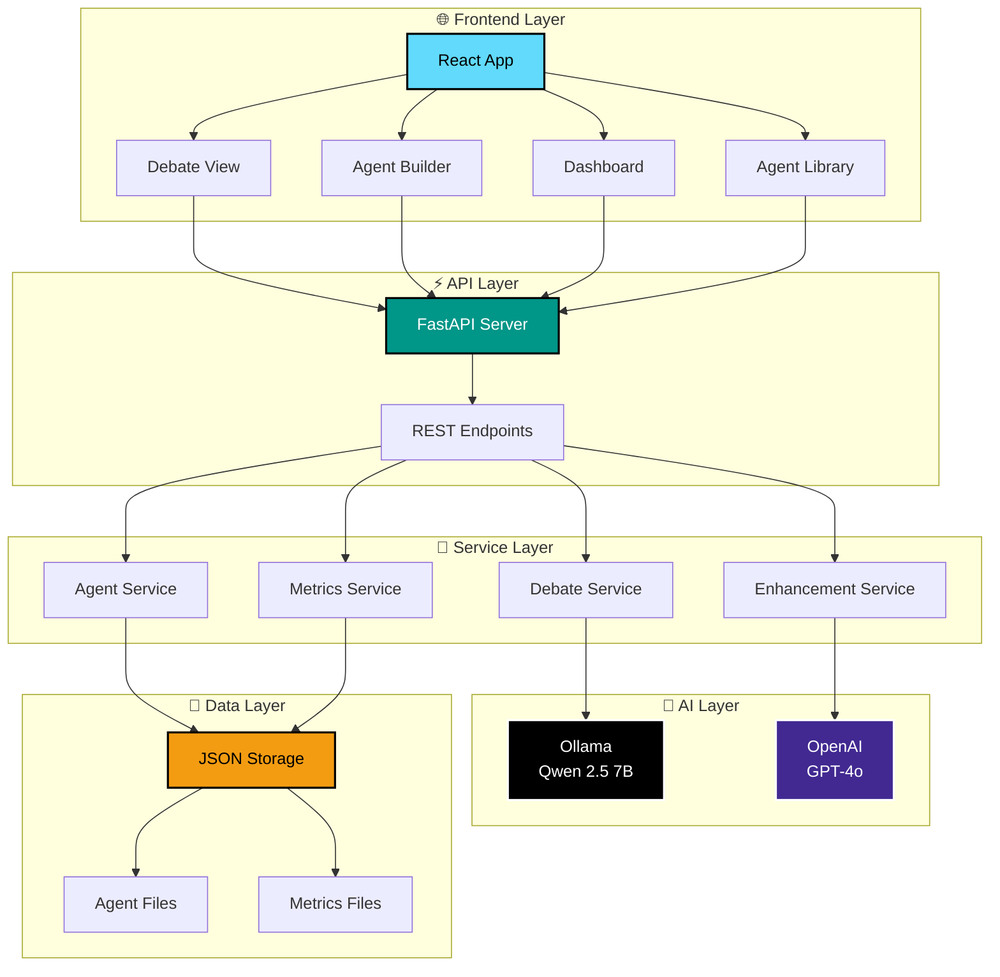
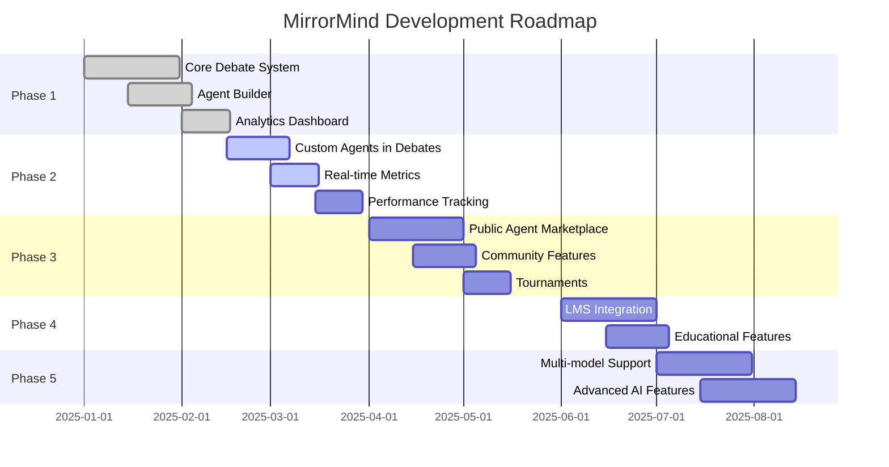

<div align="center">

# 🌌 MirrorMind 🌌

### ⚡ **WHERE AI AGENTS BATTLE IN PHILOSOPHICAL THUNDERDOMES** ⚡

<p align="center">
  
  
  
  
  
  
</p>

<div align="center">

```diff
+ 🤖 AI Agents Debate Ethics in Real-Time
+ ✨ Build Custom Agents with GPT-4o Enhancement
+ 📊 Track Performance Across 5 Ethical Dimensions
+ 🎨 Sleek Dark UI with Smooth Animations
+ 🔥 Powered by Ollama + Groq + OpenAI
```

</div>

**[⚡ Quick Start](#-installation-in-5-minutes)** • 
**[🎮 Features](#-core-features)** • 
**[✨ Agent Builder](#-agent-builder-create-your-champion)** • 
**[🗺️ Roadmap](#-roadmap)**

---

</div>

## 🎯 What Is This Sorcery?

<table>
<tr>
<td width="60%">

**MirrorMind** is an AI-powered platform where philosophical agents engage in **structured ethical debates**. 

Think of it as a **philosophical cage match** where:
- 🥊 AI agents represent different moral frameworks
- ⚖️ They debate real ethical dilemmas you submit
- 🧠 Each agent has unique reasoning patterns
- 📊 Debates are scored across 5 ethical dimensions
- 🏆 A judge declares the winner with detailed reasoning

But here's the **game-changer**: You can **BUILD YOUR OWN AGENTS** with our AI-powered Agent Builder!

</td>
<td width="40%">



</td>
</tr>
</table>

---

## 🔥 Core Features

<details open>
<summary><h3>🎭 Three Default Philosophical Champions</h3></summary>

<table>
<tr>
<td align="center" width="33%">

### ⚖️ **DEON**
**The Deontologist**

```
┌─────────────────┐
│   DUTY FIRST    │
│   RULES MATTER  │
│   KANT APPROVED │
└─────────────────┘
```

Believes in **universal moral laws** and **categorical imperatives**. 

*"It's not about outcomes—it's about doing what's RIGHT."*

</td>
<td align="center" width="33%">

### ◆ **CONSE**
**The Consequentialist**

```
┌─────────────────┐
│  OUTCOMES RULE  │
│  MAXIMIZE GOOD  │
│  BENTHAM VIBES  │
└─────────────────┘
```

Focuses on **maximizing utility** and **the greater good**.

*"Show me the numbers. What produces the best outcome?"*

</td>
<td align="center" width="33%">

### ✦ **VIRTUE**
**The Virtue Ethicist**

```
┌─────────────────┐
│ CHARACTER FIRST │
│ WISDOM MATTERS  │
│ ARISTOTLE MODE  │
└─────────────────┘
```

Emphasizes **character development** and **human flourishing**.

*"What would a virtuous person do in this situation?"*

</td>
</tr>
</table>

</details>

<details open>
<summary><h3>✨ Agent Builder: CREATE YOUR CHAMPION</h3></summary>


This is the **CROWN JEWEL** of MirrorMind. Build your own custom ethical AI agent in 4 steps:



#### 🎨 **Step 1: Identity**
- Choose a name for your agent
- Pick from **32 emoji avatars** (🌱🔥💎🌊⚡🎭🦁🌙 and more!)

#### 📝 **Step 2: Personality Description**
- Write 50-1000 characters describing your agent's:
  - Core values and beliefs
  - Ethical framework
  - Decision-making approach
  - Philosophical influences

#### ✨ **Step 3: GPT-4o Enhancement** ⭐ **THIS IS WHERE THE MAGIC HAPPENS** ⭐
Our AI analyzes your description and enhances it with:
- 🎯 **Concrete examples** and case studies
- 📚 **Citations** to philosophical works
- 🧠 **Reasoning frameworks** for consistency
- 🔍 **Specific terminology** and concepts

**Quality Scoring Across 4 Dimensions:**

<table>
<tr>
<td align="center">

**📊 CLARITY**
```
████████░░ 9.2/10
```
Sentence structure<br/>& readability

</td>
<td align="center">

**✅ COMPLETENESS**
```
████████░░ 8.8/10
```
Presence of key<br/>elements

</td>
<td align="center">

**🎯 SPECIFICITY**
```
█████████░ 9.5/10
```
Concrete vs<br/>vague terms

</td>
<td align="center">

**🔗 CONSISTENCY**
```
█████████░ 9.0/10
```
Logical<br/>coherence

</td>
</tr>
</table>

#### 👁️ **Step 4: Preview & Deploy**
- Review the enhanced personality
- Regenerate if you want different improvements
- Deploy your agent to the library
- **Use it in debates!** (Coming in Phase 2)

---

### 🎬 **Real Enhancement Example**

<table>
<tr>
<td width="50%">

#### 📝 **BEFORE** (Your Input)
```
"This agent is a doctor who 
believes in patient autonomy 
above all else."
```

**Length:** 58 characters  
**Specificity:** ⭐⭐⭐☆☆  
**Framework:** ❌ Missing  
**Examples:** ❌ None  

</td>
<td width="50%">

#### ✨ **AFTER** (GPT-4o Enhanced)
```
"Dr. Maya Chen champions patient 
autonomy as the cornerstone of 
medical ethics. She applies a 
framework rooted in informed consent 
and bodily autonomy, citing landmark 
cases like Cruzan v. Director to 
support her positions. When evaluating 
medical dilemmas, she prioritizes the 
patient's right to make their own 
healthcare decisions, even when those 
choices conflict with medical 
recommendations. Her approach 
acknowledges the tension between 
beneficence and autonomy, but she 
consistently argues that respecting 
patient agency is fundamental to 
ethical care."
```

**Length:** 587 characters  
**Specificity:** ⭐⭐⭐⭐⭐  
**Framework:** ✅ Clear  
**Examples:** ✅ Case citations  

</td>
</tr>
</table>

</details>

<details open>
<summary><h3>⚖️ Structured Debate System</h3></summary>



**Debate Flow:**
1. 🎯 **Dilemma Submission** - User provides ethical scenario with 2 options
2. 🎭 **Agent Selection** - Choose 3 agents (default or custom)
3. 🎲 **Stance Assignment** - Each agent picks Option A or B
4. 💬 **Round 1** - Opening arguments (each agent makes their case)
5. 🔄 **Round 2** - Counter-arguments (agents respond to each other)
6. ⚖️ **Judgment** - Judge analyzes and scores on 5 dimensions
7. 🏆 **Verdict** - Winner declared with detailed reasoning

</details>

<details open>
<summary><h3>📊 Ethical Scoring System</h3></summary>

Every debate is scored across **5 ethical dimensions**:

| Dimension | Description | Example |
|-----------|-------------|---------|
| 🛡️ **Harm Minimization** | Does it reduce suffering? | Preventing disease vs. side effects |
| 📜 **Rule Consistency** | Does it follow moral principles? | Keeping promises, respecting rights |
| 🗽 **Autonomy** | Does it respect individual choice? | Informed consent, self-determination |
| 💎 **Honesty** | Does it involve truthfulness? | Transparency, avoiding deception |
| ⚖️ **Fairness** | Does it treat people equally? | Justice, impartiality, equity |

**Scoring:** Each dimension is rated **0/2, 1/2, or 2/2** for each option.

</details>

---

## 🚀 INSTALLATION IN 5 MINUTES


### ⚡ Prerequisites

<table>
<tr>
<td align="center" width="25%">

**🐍 Python 3.8+**

[Download](https://python.org)

</td>
<td align="center" width="25%">

**📦 Node.js 16+**

[Download](https://nodejs.org)

</td>
<td align="center" width="25%">

**🦙 Ollama**

[Download](https://ollama.ai)

</td>
<td align="center" width="25%">

**🔑 OpenAI Key**

[Get Key](https://platform.openai.com)

</td>
</tr>
</table>

---

### 🎮 Installation Steps

<details>
<summary><b>Step 1️⃣: Clone Repository</b></summary>

```bash
git clone https://github.com/khattam/MirrorMind.git
cd MirrorMind
```

</details>

<details>
<summary><b>Step 2️⃣: Backend Setup</b></summary>

```bash
cd backend

# Create virtual environment
python -m venv .venv

# Activate it
# Windows:
.venv\Scripts\activate
# macOS/Linux:
source .venv/bin/activate

# Install dependencies
pip install fastapi uvicorn requests python-dotenv pydantic openai

# Create .env file
echo "OPENAI_API_KEY=sk-your-key-here" > .env
```

</details>

<details>
<summary><b>Step 3️⃣: Frontend Setup</b></summary>

```bash
cd ../frontend
npm install
```

</details>

<details>
<summary><b>Step 4️⃣: AI Model Setup</b></summary>

```bash
# Start Ollama
ollama serve

# Pull Qwen 2.5 7B (the debate engine)
ollama pull qwen2.5:7b-instruct-q4_K_M
```

</details>

<details>
<summary><b>Step 5️⃣: LAUNCH! 🚀</b></summary>

**Terminal 1 - Backend:**
```bash
cd backend
uvicorn main:app --reload
```

**Terminal 2 - Frontend:**
```bash
cd frontend
npm run dev
```

**Open Browser:**
```
http://localhost:5173
```

**🎉 YOU'RE LIVE! 🎉**

</details>

---

## 🏗️ ARCHITECTURE



### 🔧 Tech Stack

<table>
<tr>
<td width="50%">

#### **Frontend**
- ⚛️ **React 18** - Modern UI library
- ⚡ **Vite** - Lightning-fast build tool
- 🎨 **Modern CSS** - Custom styling with animations
- 🎭 **Component Architecture** - Modular & reusable

#### **Backend**
- 🚀 **FastAPI** - High-performance async API
- 🐍 **Python 3.8+** - Clean, readable code
- 📦 **Pydantic** - Data validation
- 🔄 **Async/Await** - Non-blocking operations

</td>
<td width="50%">

#### **AI Models**
- 🦙 **Ollama** - Local AI inference
- 🧠 **Qwen 2.5 7B** - Debate reasoning engine
- ✨ **GPT-4o** - Agent enhancement
- 📊 **Structured Output** - JSON schema validation

#### **Storage**
- 📁 **JSON Files** - Simple & readable
- 🔍 **File-based** - Easy version control
- 💾 **Lightweight** - No database overhead

</td>
</tr>
</table>

---

## 🎯 USE CASES

<table>
<tr>
<td width="50%">

### 🎓 **Education**

**Philosophy Classes**
- Demonstrate ethical frameworks in action
- Compare different moral philosophies
- Generate discussion topics

**Critical Thinking**
- Analyze argument structure
- Identify logical patterns
- Practice persuasion techniques

**Debate Training**
- Learn from AI argumentation
- Study counter-argument strategies
- Develop reasoning skills

</td>
<td width="50%">

### 🔬 **Research**

**AI Ethics**
- Study how LLMs reason about morality
- Test bias in ethical decision-making
- Explore alignment challenges

**Argument Analysis**
- Examine persuasion patterns
- Quantify reasoning quality
- Compare framework effectiveness

**Data Collection**
- Build debate datasets
- Analyze ethical reasoning
- Test moral theories

</td>
</tr>
<tr>
<td width="50%">

### 💼 **Professional**

**Ethics Training**
- Workplace scenario analysis
- Policy decision exploration
- Compliance training

**Decision Making**
- Multi-perspective analysis
- Risk assessment
- Stakeholder consideration

**Legal & Medical**
- Case study exploration
- Ethical dilemma preparation
- Professional development

</td>
<td width="50%">

### 🎮 **Entertainment**

**Philosophical Fun**
- Engage with deep questions
- Challenge your beliefs
- Discover new perspectives

**Agent Creation**
- Build your ideal ethical AI
- Test different personalities
- Compete in tournaments

**Social Sharing**
- Share epic debates
- Create meme-worthy agents
- Discuss with friends

</td>
</tr>
</table>

---

## 🗺️ ROADMAP



### ✅ **Phase 1: Foundation** (COMPLETE)

- [x] Core debate system with 3 agents
- [x] Structured debate flow
- [x] **Custom Agent Builder with GPT-4o enhancement** ⭐
- [x] Quality scoring (4 dimensions)
- [x] Agent library with CRUD
- [x] Analytics dashboard
- [x] Dark UI with animations

### 🚧 **Phase 2: Integration** (IN PROGRESS)

- [ ] 🎭 **Custom agents participate in live debates**
- [ ] 📊 Real-time metrics collection
- [ ] 🏆 Agent performance tracking
- [ ] 📄 Export debates (PDF/Markdown)
- [ ] 🔍 Advanced search & filtering
- [ ] 💾 Database migration

### 🔮 **Phase 3: Social Features**

- [ ] 🌐 Public agent marketplace
- [ ] ⭐ Community ratings & reviews
- [ ] 🏆 Agent tournaments & leaderboards
- [ ] 📱 Social media sharing
- [ ] 👥 Multiplayer debates
- [ ] 💬 Comment system

### 🎓 **Phase 4: Educational Platform**

- [ ] 🎒 LMS integration
- [ ] 📚 Curriculum scenarios
- [ ] 📈 Student progress tracking
- [ ] 📝 Assignment templates
- [ ] 👨‍🏫 Instructor dashboard
- [ ] 🎓 Certification system

### 🚀 **Phase 5: Advanced AI**

- [ ] 🤖 Multi-model support (GPT-4, Claude, Llama)
- [ ] 🧠 Agent learning from outcomes
- [ ] 🏥 Domain-specific agents
- [ ] 🔍 Fallacy detection
- [ ] 🎯 Real-time coaching
- [ ] 🌍 Multi-language support

---

## 🤝 CONTRIBUTING


We welcome contributions! Here's how you can help:

<details>
<summary><b>🐛 Report Bugs</b></summary>

1. Check [existing issues](https://github.com/khattam/MirrorMind/issues)
2. Create new issue with:
   - Clear title
   - Steps to reproduce
   - Expected vs actual behavior
   - Screenshots if applicable
   - Environment details

</details>

<details>
<summary><b>💡 Suggest Features</b></summary>

1. Open a [Discussion](https://github.com/khattam/MirrorMind/discussions)
2. Describe the feature
3. Explain the use case
4. Get community feedback
5. Create an issue if approved

</details>

<details>
<summary><b>💻 Submit Code</b></summary>

```bash
# 1. Fork the repository
# 2. Create feature branch
git checkout -b feature/amazing-feature

# 3. Make your changes
# 4. Test thoroughly
# 5. Commit with clear message
git commit -m "Add amazing feature"

# 6. Push to your fork
git push origin feature/amazing-feature

# 7. Open Pull Request
# 8. Wait for review
# 9. Celebrate! 🎉
```

</details>

<details>
<summary><b>📚 Improve Documentation</b></summary>

- Fix typos and grammar
- Add examples and tutorials
- Clarify confusing sections
- Translate to other languages
- Create video guides

</details>

<details>
<summary><b>🎨 Design Contributions</b></summary>

- UI/UX improvements
- New themes and color schemes
- Icon and logo designs
- Animation ideas
- Accessibility enhancements

</details>

---

## 🛠️ TROUBLESHOOTING

<details>
<summary><b>❌ Ollama Connection Issues</b></summary>

```bash
# Check if Ollama is running
ollama serve

# Verify model is downloaded
ollama list

# Pull model if missing
ollama pull qwen2.5:7b-instruct-q4_K_M

# Test model
ollama run qwen2.5:7b-instruct-q4_K_M "Hello"
```

</details>

<details>
<summary><b>❌ OpenAI API Errors</b></summary>

```bash
# Check .env file exists
cat backend/.env

# Verify key format
# Should be: OPENAI_API_KEY=sk-...

# Test key validity
curl https://api.openai.com/v1/models \
  -H "Authorization: Bearer YOUR_KEY"
```

</details>

<details>
<summary><b>❌ Frontend Won't Start</b></summary>

```bash
# Clear and reinstall
cd frontend
rm -rf node_modules package-lock.json
npm install
npm run dev

# Check Node version
node --version  # Should be 16+
```

</details>

<details>
<summary><b>❌ Backend Crashes</b></summary>

```bash
# Check Python version
python --version  # Should be 3.8+

# Reinstall dependencies
pip install --upgrade fastapi uvicorn requests python-dotenv pydantic openai

# Check for port conflicts
# Backend runs on port 8000
# Make sure nothing else is using it
```

</details>

<details>
<summary><b>❌ Agent Enhancement Not Working</b></summary>

1. Verify OpenAI API key is set in `.env`
2. Check API key has credits
3. Ensure internet connection is stable
4. Try regenerating the enhancement
5. Check browser console for errors

</details>

---

## 📊 PROJECT STATS

<div align="center">

```
╔═══════════════════════════════════════════════════════════════╗
║                    🚀 MIRRORMIND STATS �                     ║
╠═══════════════════════════════════════════════════════════════╣
║                                                               ║
║  ⭐ GitHub Stars:        [Growing Daily]                     ║
║  🍴 Forks:               [Join the Community]                ║
║  🐛 Issues Closed:       [We Squash Bugs Fast]               ║
║  💻 Contributors:        [Be the First!]                     ║
║  📦 Commits:             [Always Improving]                  ║
║                                                               ║
║  🎭 Default Agents:      3 (Deon, Conse, Virtue)             ║
║  ✨ Custom Agents:       Unlimited!                          ║
║  🧠 AI Models:           2 (Ollama + GPT-4o)                 ║
║  📊 Ethical Dimensions:  5 (Harm, Rules, Autonomy, etc.)     ║
║  🎨 Emoji Avatars:       32 Options                          ║
║  ⚡ Avg Debate Time:     ~30 seconds                         ║
║  🔥 Lines of Code:       [Thousands of Pure Art]             ║
║                                                               ║
╚═══════════════════════════════════════════════════════════════╝
```

</div>

---

## 🙏 ACKNOWLEDGMENTS

<table>
<tr>
<td align="center" width="20%">

**🦙 Ollama**

Local AI<br/>Infrastructure

[ollama.ai](https://ollama.ai)

</td>
<td align="center" width="20%">

**🧠 OpenAI**

GPT-4o<br/>Enhancement

[openai.com](https://openai.com)

</td>
<td align="center" width="20%">

**🚀 FastAPI**

Python Web<br/>Framework

[fastapi.tiangolo.com](https://fastapi.tiangolo.com)

</td>
<td align="center" width="20%">

**⚛️ React**

UI Library

[reactjs.org](https://reactjs.org)

</td>
<td align="center" width="20%">

**⚡ Vite**

Build Tool

[vitejs.dev](https://vitejs.dev)

</td>
</tr>
</table>

### 💖 Special Thanks

- **Philosophy Professors** who inspired this project
- **Open Source Community** for making this possible
- **Early Testers** who found all the bugs
- **Coffee** ☕ for keeping us awake
- **You** 👋 for checking this out!

---

## 📞 CONNECT

<div align="center">

### 🌐 Links

[](https://github.com/khattam/MirrorMind)
[](https://github.com/khattam/MirrorMind/issues)
[](https://github.com/khattam/MirrorMind/discussions)
[](https://github.com/khattam/MirrorMind)

---

### 📬 Get In Touch

**Questions? Ideas? Just want to say hi?**

📧 Email • 🐦 Twitter • 💼 LinkedIn • 🌐 Website

</div>

---

## 📜 LICENSE

```
MIT License

Copyright (c) 2025 MirrorMind

Permission is hereby granted, free of charge, to any person obtaining a copy
of this software and associated documentation files (the "Software"), to deal
in the Software without restriction, including without limitation the rights
to use, copy, modify, merge, publish, distribute, sublicense, and/or sell
copies of the Software, and to permit persons to whom the Software is
furnished to do so, subject to the following conditions:

The above copyright notice and this permission notice shall be included in all
copies or substantial portions of the Software.

THE SOFTWARE IS PROVIDED "AS IS", WITHOUT WARRANTY OF ANY KIND, EXPRESS OR
IMPLIED, INCLUDING BUT NOT LIMITED TO THE WARRANTIES OF MERCHANTABILITY,
FITNESS FOR A PARTICULAR PURPOSE AND NONINFRINGEMENT.
```

**TL;DR:** Do whatever you want with this code. Just don't sue us. 😎

---

<div align="center">

## 🔥 FINAL WORDS

```
╔═══════════════════════════════════════════════════════════════╗
║                                                               ║
║  "The unexamined life is not worth living."                   ║
║                                        - Socrates             ║
║                                                               ║
║  "But the examined life is way more fun with AI."             ║
║                                        - MirrorMind Team      ║
║                                                               ║
╚═══════════════════════════════════════════════════════════════╝
```

MirrorMind isn't just a project—it's an **experiment in AI ethics**, a **playground for philosophical exploration**, and a **testament to what happens when you combine modern AI with ancient wisdom**.

### ✨ What Makes MirrorMind Special?

- 🎭 **Watch AI agents debate** from different philosophical perspectives
- ✨ **Build custom agents** with GPT-4o-powered enhancement
- 📊 **Track ethical reasoning** across 5 dimensions
- 🎨 **Beautiful UI** with smooth animations
- 🔥 **Powered by cutting-edge AI** (Ollama + OpenAI)
- 🌟 **Open source** and free to use

### 🚀 Ready to Start?

```bash
git clone https://github.com/khattam/MirrorMind.git
cd MirrorMind
# Follow installation guide above
# Start debating! 🎉
```

### ⭐ Show Some Love

If you think this project is cool, **star the repo**! It helps others discover it and motivates us to keep building.

### 🤝 Join the Community

- 💬 [Discussions](https://github.com/khattam/MirrorMind/discussions) - Ask questions, share ideas
- 🐛 [Issues](https://github.com/khattam/MirrorMind/issues) - Report bugs, request features
- 🔧 [Pull Requests](https://github.com/khattam/MirrorMind/pulls) - Contribute code
- 📢 **Spread the word** - Share with friends!

---

### 🎭 Built with ❤️, ☕, and philosophical debates

**Made by humans • Enhanced by AI • Debated by agents**

---

⭐ **Star this repo** if you believe AI can help us think better about ethics!

🔥 **Fork it** if you want to build something even cooler!

🚀 **Contribute** if you want to be part of the future!

---

**MirrorMind** • *Where Philosophy Meets AI* • **2025**

</div>
