# MirrorMind AI

<div align="center">

### **AI Agents Debate Ethics. You Build Them. We Judge Them.**

[](https://mirror-mind-ai.vercel.app)
[](https://mirrormind-ai.onrender.com)

[](https://python.org)
[](https://reactjs.org)
[](https://fastapi.tiangolo.com)
[](LICENSE)

**[📖 Quick Start](#installation)** • **[🎯 Features](#features)** • **[🧠 How It Works](#how-it-works)** • **[🛠️ Tech Stack](#tech-stack)**

</div>

---

## What's This About?

You know those impossible ethical dilemmas that keep you up at 3 AM? The trolley problem? Self-driving car decisions? Whether to lie to save a life?

**MirrorMind lets AI agents fight it out for you.**

Submit a dilemma. Watch three AI agents with different moral frameworks debate it in real-time. See a judge score their arguments across five ethical dimensions. Then do it again with your own custom agents.

It's like a philosophical cage match, but with more citations and less blood.

---

## 🎯 Features

### 🥊 AI Debate Arena

Three philosophical heavyweights enter. One argument wins.

- **Deon** (The Deontologist) - "Rules are rules. Period."
- **Conse** (The Consequentialist) - "Show me the outcomes."
- **Virtue** (The Virtue Ethicist) - "What would a good person do?"

**How it works:**
1. You submit an ethical dilemma with two options
2. Each agent picks a side and argues for it
3. They go back and forth in structured rounds
4. A judge evaluates everything and declares a winner

**The cool part:** Watch them actually respond to each other's arguments. They're not just talking past each other—they're having a real debate.

---

### ✨ Agent Builder

Here's where it gets interesting. You can build your own ethical AI agents.

**The Process:**
1. **Name your agent** - "Dr. Maya Chen" or "The Utilitarian Robot" or whatever
2. **Pick an avatar** - 32 emoji options (🌱🔥💎🌊⚡🎭🦁🌙 and more)
3. **Write a description** - 50-1000 characters about their ethical framework
4. **Hit enhance** - GPT-4o transforms your description into a full philosophical framework

**What happens during enhancement:**
- Your 50-word idea becomes a 500-word ethical framework
- Adds concrete examples and case studies
- Cites actual philosophical works
- Structures their reasoning approach
- Scores quality across 4 dimensions

**Example transformation:**

```
BEFORE (your input):
"A doctor who believes in patient autonomy above all else."

AFTER (GPT-4o enhancement):
"Dr. Maya Chen champions patient autonomy as the cornerstone of medical 
ethics. She applies a framework rooted in informed consent and bodily 
autonomy, citing landmark cases like Cruzan v. Director to support her 
positions. When evaluating medical dilemmas, she prioritizes the patient's 
right to make their own healthcare decisions, even when those choices 
conflict with medical recommendations. Her approach acknowledges the 
tension between beneficence and autonomy, but she consistently argues 
that respecting patient agency is fundamental to ethical care."
```

**Quality Scoring:**
- **Clarity** - Is it readable and well-structured?
- **Completeness** - Does it have all the key elements?
- **Specificity** - Concrete examples vs vague statements?
- **Consistency** - Does the logic hold together?

Each dimension scored 0-10. You can regenerate until you're happy with it.

---

### 📊 Analytics Dashboard

Because what's the point of debates if you can't track who's winning?

**Metrics tracked:**
- Total debates conducted
- Win rates by agent
- Average scores per ethical dimension
- Most debated dilemmas
- Debate history with full transcripts

**The judge scores every debate across 5 dimensions:**
- 🛡️ **Harm Minimization** - Does it reduce suffering?
- 📜 **Rule Consistency** - Does it follow moral principles?
- 🗽 **Autonomy Respect** - Does it honor individual choice?
- 💎 **Honesty** - Does it involve truthfulness?
- ⚖️ **Fairness** - Does it treat people equally?

Each option gets 0-2 points per dimension. Highest total wins.

---

### ⚖️ The Judge

An impartial AI that:
- Analyzes all arguments from both sides
- Scores each option across 5 ethical dimensions
- Declares a winner with confidence level
- Explains its reasoning in detail

No bias. No favorites. Just cold, hard ethical analysis.

---

## 🧠 How It Works

### The Debate Flow

```mermaid
graph TD
    A[👤 You Submit Dilemma] --> B[🎭 Agents Analyze & Pick Sides]
    B --> C[💬 Round 1: Opening Arguments]
    C --> D[🔄 Round 2: Rebuttals]
    D --> E[⚖️ Judge Evaluates Everything]
    E --> F[🏆 Winner Declared with Scores]
    F --> G[💾 Saved to History]
    
    style A fill:#1a1a2e,stroke:#00ff88,stroke-width:3px,color:#fff
    style B fill:#1a1a2e,stroke:#00d9ff,stroke-width:2px,color:#fff
    style C fill:#1a1a2e,stroke:#00d9ff,stroke-width:2px,color:#fff
    style D fill:#1a1a2e,stroke:#00d9ff,stroke-width:2px,color:#fff
    style E fill:#1a1a2e,stroke:#ff6b6b,stroke-width:2px,color:#fff
    style F fill:#1a1a2e,stroke:#ffd700,stroke-width:3px,color:#fff
    style G fill:#1a1a2e,stroke:#00ff88,stroke-width:2px,color:#fff
```



### The Enhancement Pipeline


---

## 🛠️ Tech Stack

### The Fun Stuff

**Frontend:**
- React 18 because hooks are life
- Vite because waiting for builds is for chumps
- Pure CSS because we don't need no stinking UI library
- Custom animations because smooth is smooth

**Backend:**
- FastAPI because async/await is beautiful
- Python 3.8+ with type hints because we're not animals
- Pydantic for validation because data should make sense
- JSON files because sometimes simple is better

**AI Magic:**
- **Groq API** with Llama 3.3 70B for debates (fast as hell)
- **OpenAI GPT-4o** for agent enhancement (quality over speed)
- Structured JSON output because we like predictable responses
- Error handling with fallbacks because AI is weird sometimes

**Deployment:**
- Vercel for frontend (auto-deploy from GitHub)
- Render for backend (free tier that actually works)
- GitHub Actions for uptime (pings every 5 minutes)
- Vercel Analytics because we like knowing who visits

### The Architecture

```mermaid
graph TB
    subgraph Frontend["🎨 Frontend Layer"]
        A[React + Vite]
        B[Debate Visualization]
        C[Agent Builder UI]
        D[Analytics Dashboard]
    end
    
    subgraph Backend["⚡ Backend Layer"]
        E[FastAPI Server]
        F[Debate Service]
        G[Agent Service]
        H[Metrics Service]
    end
    
    subgraph AI["🤖 AI Layer"]
        I[Groq API<br/>Llama 3.3 70B]
        J[OpenAI API<br/>GPT-4o]
    end
    
    subgraph Storage["💾 Storage Layer"]
        K[JSON Files<br/>Agents & Metrics]
    end
    
    A --> E
    B --> E
    C --> E
    D --> E
    E --> F
    E --> G
    E --> H
    F --> I
    G --> J
    G --> K
    H --> K
    
    style Frontend fill:#1a1a2e,stroke:#00d9ff,stroke-width:2px,color:#fff
    style Backend fill:#1a1a2e,stroke:#00ff88,stroke-width:2px,color:#fff
    style AI fill:#1a1a2e,stroke:#ff6b6b,stroke-width:2px,color:#fff
    style Storage fill:#1a1a2e,stroke:#ffd700,stroke-width:2px,color:#fff
```



### Why These Choices?

**Groq for debates:**
- Insanely fast inference (like, really fast)
- Llama 3.3 70B is smart enough for philosophical reasoning
- Free tier is generous
- Structured output works reliably

**OpenAI for enhancement:**
- GPT-4o is the best at understanding and expanding concepts
- Consistent quality in output
- Good at following complex instructions
- Worth the cost for this use case

**JSON storage:**
- Simple and readable
- Easy to version control
- No database overhead
- Perfect for MVP
- Will migrate to PostgreSQL in Phase 2

**FastAPI:**
- Async/await for non-blocking operations
- Automatic API docs (Swagger)
- Type hints everywhere
- Fast as hell
- Python is fun

---

## 🚀 Installation

### What You Need

- Python 3.8+ (check: `python --version`)
- Node.js 16+ (check: `node --version`)
- Groq API key ([get free key](https://console.groq.com))
- OpenAI API key ([get key](https://platform.openai.com))

### Let's Go

```bash
# Clone it
git clone https://github.com/khattam/MirrorMind-AI.git
cd MirrorMind-AI

# Backend setup
cd backend
python -m venv .venv
source .venv/bin/activate  # Windows: .venv\Scripts\activate
pip install -r requirements.txt

# Add your API keys
cp .env.example .env
# Edit .env:
#   GROQ_API_KEY=your_groq_key_here
#   OPENAI_API_KEY=your_openai_key_here
#   AI_PROVIDER=groq
#   GROQ_MODEL=llama-3.3-70b-versatile

# Frontend setup
cd ../frontend
npm install

# Run backend (Terminal 1)
cd backend
uvicorn main:app --reload

# Run frontend (Terminal 2)
cd frontend
npm run dev

# Open http://localhost:5173
# Start debating!
```

---

## 🗺️ Roadmap

### ✅ Phase 1: Foundation (DONE)
- Core debate system
- Three default agents
- Custom agent builder with GPT-4o enhancement
- Quality scoring system
- Analytics dashboard
- Debate history
- Dark theme UI

### 🚧 Phase 2: Integration (IN PROGRESS)
**What's Missing:**
- Custom agents can't join debates yet (they're built but not integrated)
- No user authentication (everyone shares the same agent library)
- No user profiles or ownership

**Coming Soon:**
- Custom agents in live debates
- User login/signup
- Personal agent libraries
- Performance leaderboards
- Export debates (PDF/Markdown)
- Database migration

### 🔮 Phase 3: Social
- Public agent marketplace
- Community ratings
- Agent tournaments
- Social sharing
- Multiplayer debates

### 🎓 Phase 4: Education
- LMS integration
- Curriculum scenarios
- Student tracking
- Instructor dashboard

### 🚀 Phase 5: Advanced AI
- Multi-model support (GPT-4, Claude, Llama)
- Agent learning from outcomes
- Domain-specific agents
- Fallacy detection
- Multi-language support

---

## 🎯 Use Cases

**For Students:**
- See ethical frameworks in action
- Learn argument structure
- Practice critical thinking
- Prepare for philosophy exams

**For Researchers:**
- Study AI moral reasoning
- Analyze argument patterns
- Generate debate datasets
- Test ethical theories

**For Professionals:**
- Ethics training scenarios
- Multi-perspective analysis
- Case study exploration
- Decision-making frameworks

**For Fun:**
- Philosophical thought experiments
- Build ridiculous agents
- Share epic debates
- Challenge your beliefs

---

## 🤝 Contributing

Want to help? Here's what we need:

**Code:**
- Frontend components
- Backend optimization
- Test coverage
- Bug fixes

**Content:**
- Documentation
- Tutorials
- Translations
- Example scenarios

**Ideas:**
- Feature suggestions
- UI/UX improvements
- Agent personalities
- Debate formats

```bash
# Standard flow
git checkout -b feature/cool-thing
# Make it cool
git commit -m "Add cool thing"
git push origin feature/cool-thing
# Open PR
```

---

## 🐛 Troubleshooting

**Backend won't start:**
```bash
python --version  # Need 3.8+
pip install -r requirements.txt
cat backend/.env  # Check API keys
```

**Frontend won't start:**
```bash
node --version  # Need 16+
rm -rf node_modules package-lock.json
npm install
```

**Debates failing:**
- Check Groq API key is valid
- Verify you have API credits
- Check internet connection
- Look at browser console

**Enhancement not working:**
- Check OpenAI API key
- Verify you have credits
- Try regenerating
- Check browser console

---

## 📊 Stats

- **Lines of Code:** ~5,000+
- **React Components:** 15+
- **API Endpoints:** 20+
- **Default Agents:** 3
- **Custom Agents:** Unlimited
- **Ethical Dimensions:** 5
- **Emoji Avatars:** 32
- **Average Debate:** ~30 seconds
- **Enhancement Time:** ~3 seconds
- **Quality Scores:** 4 dimensions

---

## 📜 License

MIT License - do whatever you want with this code.

---

## 🙏 Thanks To

- **Groq** for fast AI inference
- **OpenAI** for GPT-4o magic
- **FastAPI** for making Python web dev fun
- **React** for making UIs not terrible
- **Vite** for making builds not slow
- **Coffee** for making this possible
- **You** for reading this far

---

<div align="center">

## 🚀 [Try It Now](https://mirror-mind-ai.vercel.app)

**MirrorMind AI** • *Where Philosophy Meets AI*

⭐ **Star this repo** if you think it's cool

🔥 **Fork it** if you want to build something cooler

💬 **Open an issue** if something breaks

**Made with ❤️ and way too much coffee**

---

**[GitHub](https://github.com/khattam/MirrorMind-AI)** • **[Issues](https://github.com/khattam/MirrorMind-AI/issues)** • **[Discussions](https://github.com/khattam/MirrorMind-AI/discussions)**

</div>
