# MirrorMind AI - Final Technical Documentation

**Version:** 1.0  
**Date:** February 10, 2026  
**Author:** Medhansh Khattam  
**Project:** Multi-Agent Ethical Debate Platform

---

## Executive Summary

MirrorMind AI is a web-based platform enabling AI agents with distinct ethical frameworks to debate complex moral dilemmas in real-time. Users submit ethical scenarios, watch AI agents argue from philosophical perspectives (deontological, consequentialist, virtue ethics), and receive impartial judgments scored across five ethical dimensions.

**Key Capabilities:**
- Multi-agent debate system with 3 default philosophical agents + custom agent creation
- GPT-4o powered agent enhancement pipeline
- Semantic deduplication for debate library (34+ templates)
- 5-dimensional ethical scoring by impartial AI judge
- Analytics dashboard with debate metrics
- Full debate history with replay functionality
- PDF export for debates

**Technology Stack:**
- **Frontend:** React 18.3, Vite, CSS3
- **Backend:** Python 3.8+, FastAPI
- **AI Models:** Groq (Llama 3.3 70B), OpenAI (GPT-4o)
- **Storage:** JSON files (atomic writes)
- **Deployment:** Vercel (frontend), Render (backend)

**Live Demo:** [mirror-mind-ai.vercel.app](https://mirror-mind-ai.vercel.app)

---

## Table of Contents

1. [System Overview](#1-system-overview)
2. [Architecture](#2-architecture)
3. [Core Features](#3-core-features)
4. [Technical Implementation](#4-technical-implementation)
5. [AI/ML Components](#5-aiml-components)
6. [API Reference](#6-api-reference)
7. [Data Models](#7-data-models)
8. [Deployment](#8-deployment)
9. [Future Enhancements](#9-future-enhancements)

---

## 1. System Overview

### 1.1 Purpose

MirrorMind AI addresses the challenge of exploring ethical dilemmas from multiple philosophical perspectives simultaneously. Traditional ethical analysis requires understanding various frameworks; MirrorMind automates this by having AI agents embody different ethical philosophies and debate in structured rounds.

### 1.2 Target Users

- **Students & Educators:** Philosophy courses, ethics training, debate practice
- **Researchers:** AI ethics studies, moral reasoning analysis, dataset generation
- **Ethics Professionals:** Corporate training, medical ethics, policy evaluation
- **General Public:** Philosophy enthusiasts, curious individuals, content creators

### 1.3 Key Innovations

1. **Multi-Agent Debate System:** First platform enabling real-time philosophical debates between AI agents with distinct ethical frameworks
2. **GPT-4o Agent Enhancement:** Transforms simple descriptions into sophisticated ethical reasoning frameworks with quality scoring
3. **Semantic Deduplication:** Hash-based embedding system (384-dim) for instant duplicate detection without API calls
4. **5-Dimensional Ethical Scoring:** Comprehensive verdict analysis across autonomy, harm prevention, fairness, transparency, and long-term impact

---

## 2. Architecture

### 2.1 System Architecture


### 2.2 Technology Stack

**Frontend:**
- React 18.3 with Hooks (useState, useEffect)
- Vite for build tooling
- CSS3 with custom dark theme
- jsPDF for PDF generation
- Fetch API for HTTP requests

**Backend:**
- Python 3.8+ with FastAPI framework
- Pydantic for data validation
- Groq SDK for Llama 3.3 70B access
- OpenAI SDK for GPT-4o access
- JSON file storage with atomic writes

**Deployment:**
- Frontend: Vercel (automatic deployments from main branch)
- Backend: Render (Python 3.8 runtime)
- CORS enabled for cross-origin requests

---

## 3. Core Features

### 3.1 AI Debate Arena

**Purpose:** Enable multi-agent ethical debates with real-time argument generation.

**Workflow:**
1. User submits dilemma (title, context, options A & B)
2. User selects 3 agents (default or custom)
3. System generates opening arguments sequentially
4. Agents engage in rebuttal rounds
5. Judge provides verdict with ethical scores

**Key Components:**
- DilemmaForm: 2-step wizard for input
- AgentSelector: 3-slot team builder
- DebateView: Real-time display with TypewriterText animation
- VerdictView: Final judgment with 5-dimensional scores

**Technical Details:**
- Sequential agent processing (prevents race conditions)
- 4-level JSON parsing fallback (fenced block → full parse → object scan → regex)
- Opponent validation ensures agents address each other
- Temperature: 0.65 for arguments, 0.3 for judge (consistency)
- Max tokens: 150-200 for arguments, 800 for verdict


**Class Diagram:**


### 3.1.2 Component Architecture (Frontend)


### 3.1.3 System Architecture (Full Stack)


### 3.1.4 Data Flow - Opening Arguments

```mermaid
sequenceDiagram
    participant User
    participant DilemmaForm
    participant App
    participant Backend
    participant AgentService
    participant Groq
    participant ClampJSON
    
    User->>DilemmaForm: Fill dilemma + select 3 agents
    DilemmaForm->>DilemmaForm: Validate Step 1 and Step 2
    DilemmaForm->>App: onSubmit(formData, agentIds, agentsInfo)
    
    App->>App: setDilemma, setStage('debate')
    App->>App: checkAndAddToLibrary (background)
    
    Note over App: Convert agent IDs to names:<br/>deon→Deon, conse→Conse, virtue→Virtue<br/>custom agents use ID directly
    
    loop For each agent in agentNames
        App->>App: setCurrentThinkingAgent(agent)
        
        App->>App: Determine agentEndpoint:<br/>Default agents: lowercase<br/>Custom agents: ID
        
        App->>Backend: POST /agent/{agentEndpoint}<br/>{title, A, B, constraints}
        
        Backend->>Backend: get_agent_system_prompt(agent_name)
        
        alt Default agent (deon/conse/virtue)
            Backend->>Backend: Return DEON_SYS/CONSE_SYS/VIRTUE_SYS
        else Custom agent
            Backend->>AgentService: get_agent(agent_id)
            AgentService-->>Backend: agent.system_prompt
            Backend->>AgentService: increment_usage(agent_id)
        end
        
        Backend->>Backend: mk_base(dilemma) + OPENING_INSTRUCT
        Backend->>Groq: call_ollama(sys_prompt, user_prompt)
        Note over Groq: Temperature: 0.65<br/>Max tokens: 150<br/>Top-p: 0.9
        Groq-->>Backend: Raw LLM response
        
        Backend->>ClampJSON: clamp_json(raw, fallback)
        ClampJSON->>ClampJSON: 1. Try ```json...``` fenced block
        ClampJSON->>ClampJSON: 2. Try parse entire text as JSON
        ClampJSON->>ClampJSON: 3. Scan for {...} objects
        ClampJSON->>ClampJSON: 4. Regex extract stance + argument
        ClampJSON-->>Backend: {stance: "A|B", argument: "text"}
        
        alt Parsing failed or argument is "—"
            Backend->>Groq: Retry with temp 0.8, max_tokens 150
            Groq-->>Backend: Second attempt
            Backend->>ClampJSON: Parse again
        end
        
        Backend-->>App: AgentTurn {agent, stance, argument}
        App->>App: turns.push(turn)
        App->>App: setTranscript({dilemma, turns: [...turns]})
        App->>App: Update DebateView (triggers re-render)
    end
    
    App->>App: setCurrentThinkingAgent(null)
    Note over App: DebateView shows "Continue Debate" button
```



### 3.1.5 Data Flow - Rebuttal Round


### 3.1.6 Component Architecture


### 3.2 Custom Agent Builder

**Purpose:** Enable users to create personalized AI agents with enhanced ethical frameworks.

**Workflow:**
1. User enters name (1-50 chars), avatar emoji, description (50-1000 chars)
2. Frontend validates uniqueness against default + custom agents
3. User clicks "Enhance with AI"
4. PromptAnalyzer scores description (clarity, completeness, specificity, consistency)
5. GPT-4o expands description into 4-5 detailed sentences
6. System generates debate-ready system prompt
7. AgentService saves with UUID to custom_agents.json
8. Agent immediately available for debates

**Quality Scoring Algorithm:**
- **Clarity (0-10):** Sentence length analysis (optimal 15-20 words)
- **Completeness (0-10):** Checks for values, reasoning, examples, personality, decision-making
- **Specificity (0-10):** Vague terms vs specific terms ratio
- **Consistency (0-10):** Detects contradictions (-2 points each)

**Enhancement Process:**
- Temperature: 0.7 for creativity
- Max tokens: 500 for detailed expansion
- Quality check: retries if <50 words or missing agent name
- Preserves original name by removing JSON fields

**Class Diagram:**


### 3.2.2 System Architecture


### 3.2.3 Data Flow - Agent Creation


### 3.2.4 Quality Scoring Algorithm

```mermaid
graph TD
    Description[User Description] --> Analyzer[Prompt Analyzer]
    
    Analyzer --> Clarity[Clarity Score 0-10]
    Analyzer --> Completeness[Completeness Score 0-10]
    Analyzer --> Specificity[Specificity Score 0-10]
    Analyzer --> Consistency[Consistency Score 0-10]
    
    Clarity --> ClarityLogic[Sentence length analysis<br/>Optimal: 15-20 words<br/>Penalize too long/short]
    
    Completeness --> CompletenessLogic[Check for elements:<br/>✓ Values/beliefs<br/>✓ Reasoning<br/>✓ Examples<br/>✓ Personality<br/>✓ Decision-making<br/>Score = present/5 * 10]
    
    Specificity --> SpecificityLogic[Count vague terms:<br/>good, bad, very, always<br/>Count specific terms:<br/>exactly, precisely, namely<br/>Penalize vague ratio]
    
    Consistency --> ConsistencyLogic[Detect contradictions:<br/>always vs sometimes<br/>strict vs flexible<br/>emotional vs logical<br/>-2 points per contradiction]
    
    ClarityLogic --> OverallScore[Overall Quality<br/>Average of 4 scores]
    CompletenessLogic --> OverallScore
    SpecificityLogic --> OverallScore
    ConsistencyLogic --> OverallScore
    
    OverallScore --> Display[Display to User<br/>Color-coded:<br/><60% red<br/>60-80% yellow<br/>>80% green]
```



### 3.3 Debate Library & Deduplication

**Purpose:** Prevent duplicate debates using semantic similarity detection.

**Workflow:**
1. When debate starts, App.jsx calls checkAndAddToLibrary() in background
2. DebateDeduplicationService validates required fields
3. EmbeddingService generates 384-dim vector (hash-based: word + char n-grams)
4. Computes cosine similarity against all existing templates
5. If similarity >= 0.95: duplicate found, returns match
6. If similarity < 0.95: unique debate, generates ID and slug, saves with atomic write
7. Frontend shows toast notification (success or duplicate)

**Embedding Algorithm:**
- For each word: hash(word) % 384, hash(reverse) % 384, hash(every other char) % 384
- For each trigram: hash(trigram) % 384
- Normalizes to unit length for cosine similarity
- Title excluded (only context/options matter)
- Instant results (no API calls)

**Class Diagram:**


### 3.3.2 Frontend Architecture

```mermaid
graph TD
    User[User Creates Custom Debate]
    
    User -->|fills form| DilemmaForm[DilemmaForm<br/>title, constraints, A, B]
    DilemmaForm -->|or browses| TemplateLibrary[Template Library Modal<br/>34+ pre-made debates]
    
    DilemmaForm -->|handleStartDebate| App[App.jsx]
    App -->|IMMEDIATELY calls| CheckDuplicate[checkAndAddToLibrary]
    
    CheckDuplicate -->|builds submission| Submission[title, context, option_a, option_b]
    Submission -->|POST fetch| API[API_URL/api/debates/submit]
    
    API -->|returns result| Response{result.success?}
    Response -->|result.added_template| SuccessNotif[setNotification success<br/>✓ Debate added to library!]
    Response -->|result.is_duplicate| DuplicateNotif[setNotification info<br/>ℹ Already exists in library]
    
    SuccessNotif -->|setTimeout 4000ms| ClearNotif[setNotification null]
    DuplicateNotif -->|setTimeout 4000ms| ClearNotif
```



### 3.3.3 Backend Architecture


### 3.4 Judge System

**Purpose:** Provide impartial ethical analysis with 5-dimensional scoring.

**Workflow:**
1. User clicks "Get Verdict"
2. Backend validates transcript, builds judge prompt
3. Calls Groq with JUDGE_SYS prompt (temp 0.3, max_tokens 800)
4. Parses verdict: final_recommendation, confidence, 5 scores, reasoning, key_considerations
5. MetricsService calculates debate stats
6. DebateHistoryService saves with UUID
7. VerdictView displays results

**5-Dimensional Scoring:**
- **Autonomy (0-10):** Respect for individual choice and self-determination
- **Harm Prevention (0-10):** Minimizing negative consequences
- **Fairness (0-10):** Equal treatment and justice
- **Transparency (0-10):** Openness and accountability
- **Long-term Impact (0-10):** Sustainability and future consequences

**Metrics Calculated:**
- Total turns/words, per-agent stats
- Stance changes (how often agents switched positions)
- Most verbose agent
- Intensity score (avg words/turn)

**Class Diagram:**


### 3.4.2 Data Flow - Verdict Generation


### 3.5 Analytics Dashboard

**Purpose:** Aggregate and visualize debate statistics.

**Metrics Tracked:**
- Total debates conducted
- Total words and turns
- Average debate length
- Most common winner (A vs B)
- Agent usage statistics
- Most used agent

**Data Storage:**
- debate_metrics.json: per-debate statistics
- Atomic writes prevent corruption
- Summary stats aggregated on-demand

**Class Diagram:**


### 3.6 Debate History & Replay

**Purpose:** Browse and replay past debates without re-running AI.

**Features:**
- Automatic saving after every verdict
- UUID for unique identification
- Stores complete transcript + verdict
- Limits to last 100 debates
- Instant replay (no AI regeneration)
- Delete functionality

**Class Diagram:**


### 3.6.2 Data Flow - Replay Debate


### 3.7 PDF Export

**Purpose:** Generate professional debate documents.

**Process:**
1. User clicks "Export to PDF"
2. PDFExporter creates jsPDF instance
3. Adds header, dilemma, rounds, verdict, scores
4. Word-wraps text (max 170mm width)
5. Adds page numbers
6. Triggers browser download

**Sections Included:**
- Header with title, date, agents
- Dilemma context and options
- All debate rounds with arguments
- Final verdict with reasoning
- 5-dimensional ethical scores

**Class Diagram:**


### 3.7.2 Data Flow - PDF Generation

```mermaid
sequenceDiagram
    participant User
    participant VerdictView
    participant PDFExporter
    participant jsPDF
    participant Browser
    
    User->>VerdictView: Click "Export to PDF"
    VerdictView->>PDFExporter: exportDebateToPDF(transcript, verdict)
    
    PDFExporter->>jsPDF: new jsPDF()
    PDFExporter->>jsPDF: setFont('helvetica')
    
    PDFExporter->>PDFExporter: _addHeader(doc, title)
    Note over PDFExporter: Add title, date, agents
    
    PDFExporter->>PDFExporter: _addDilemma(doc, dilemma)
    Note over PDFExporter: Add context, options A & B
    
    loop For each turn
        PDFExporter->>PDFExporter: _formatText(argument, maxWidth)
        PDFExporter->>jsPDF: text(agent + stance)
        PDFExporter->>jsPDF: text(formatted argument)
        
        alt Page full
            PDFExporter->>jsPDF: addPage()
        end
    end
    
    PDFExporter->>PDFExporter: _addVerdict(doc, verdict)
    Note over PDFExporter: Add recommendation,<br/>confidence, reasoning
    
    PDFExporter->>PDFExporter: _addScores(doc, scores)
    Note over PDFExporter: Add 5-dimensional<br/>ethical scores
    
    PDFExporter->>PDFExporter: _addPageNumbers(doc)
    
    PDFExporter->>jsPDF: save('debate-export.pdf')
    jsPDF->>Browser: Trigger download
    Browser->>User: Download PDF file
```

---

## 4. Technical Implementation

### 4.1 Frontend Architecture

**State Management:**
- App.jsx: Central state (stage, dilemma, transcript, verdict, selectedAgentsInfo)
- Props drilling for component communication
- useState/useEffect hooks for reactivity

**Key Components:**
- **DilemmaForm:** 2-step wizard with validation
- **AgentSelector:** 3-slot team builder with modal picker
- **DebateView:** Real-time display with collapsible rounds
- **TypewriterText:** Animated text rendering (configurable speed)
- **VerdictView:** Final judgment display with score bars
- **Dashboard:** Analytics visualization
- **DebateLibrary:** History browser with replay

**Styling:**
- Custom CSS with dark theme
- Responsive design (mobile-friendly)
- Smooth animations and transitions
- Color-coded elements (agents, stances, scores)

### 4.2 Backend Architecture

**FastAPI Endpoints:**
- POST /openings: Generate opening arguments
- POST /continue: Generate rebuttals
- POST /judge: Get verdict
- POST /agent/{agent_name}: Single agent response
- GET /api/agents: List all agents
- POST /api/agents/create: Create custom agent
- POST /api/debates/submit: Submit debate for deduplication
- GET /api/history: Get debate history

**Service Layer:**
- **AgentService:** CRUD operations for custom agents
- **EnhancementService:** GPT-4o enhancement pipeline
- **DebateDeduplicationService:** Semantic duplicate detection
- **EmbeddingService:** Hash-based embedding generation
- **MetricsService:** Debate statistics calculation
- **DebateHistoryService:** Debate storage and retrieval

**Data Storage:**
- JSON files with atomic writes (temp file → rename)
- custom_agents.json: Custom agent data
- agent_ratings.json: Agent ratings
- debate_templates.json: Debate library
- debate_metrics.json: Debate statistics
- debate_history.json: Debate transcripts

### 4.3 AI Integration

**Groq API (Llama 3.3 70B):**
- Used for: Opening arguments, rebuttals, judge verdicts
- Temperature: 0.65 for arguments, 0.3 for judge
- Max tokens: 150-200 for arguments, 800 for verdict
- Top-p: 0.9 for diversity
- Retry logic with increased temperature on failure

**OpenAI API (GPT-4o):**
- Used for: Agent enhancement
- Temperature: 0.7 for creativity
- Max tokens: 500 for detailed expansion
- Quality check with retry mechanism

**JSON Parsing (4-Level Fallback):**
1. Try ```json...``` fenced block
2. Try parse entire text as JSON
3. Scan for {...} objects
4. Regex extract stance + argument

**Prompt Engineering:**
- System prompts define agent personalities
- User prompts include dilemma context
- OPENING_INSTRUCT: "Pick a side and argue"
- CONTINUE_INSTRUCT: "Respond to opponent by name"
- JUDGE_SYS: "Impartial ethical judge"

---

## 5. AI/ML Components

### 5.1 Large Language Models

**Llama 3.3 70B (via Groq):**
- **Purpose:** Debate generation, verdict analysis
- **Strengths:** Fast inference, strong reasoning, JSON output
- **Configuration:** Temperature 0.3-0.65, top-p 0.9
- **Cost:** Free tier available

**GPT-4o (via OpenAI):**
- **Purpose:** Agent enhancement
- **Strengths:** Creative expansion, quality writing
- **Configuration:** Temperature 0.7, max_tokens 500
- **Cost:** Pay-per-token

### 5.2 Embedding System

**Hash-Based Embeddings:**
- **Dimensions:** 384 (standard embedding size)
- **Algorithm:** Word hashing + character n-grams
- **Speed:** Instant (no API calls)
- **Accuracy:** 95%+ for exact/near-exact matches

**Cosine Similarity:**
- **Threshold:** 0.95 for duplicate detection
- **Formula:** dot(v1, v2) / (norm(v1) * norm(v2))
- **Range:** 0.0 (completely different) to 1.0 (identical)

### 5.3 Quality Scoring

**PromptAnalyzer Metrics:**
- Clarity: Sentence length optimization
- Completeness: Element presence detection
- Specificity: Vague vs specific term ratio
- Consistency: Contradiction detection

**Scoring Range:** 0-10 for each dimension
**Overall Score:** Average of 4 dimensions
**Color Coding:** <60% red, 60-80% yellow, >80% green

---

## 6. API Reference

### 6.1 Debate Endpoints

**POST /openings**
```json
Request:
{
  "title": "Self-Driving Car Dilemma",
  "A": "Swerve left (kill 1 pedestrian)",
  "B": "Stay straight (kill 5 pedestrians)",
  "constraints": "Car cannot brake in time",
  "agent_names": ["deon", "conse", "virtue"]
}

Response:
{
  "turns": [
    {
      "agent": "Deon",
      "stance": "A",
      "argument": "..."
    },
    ...
  ]
}
```

**POST /continue**
```json
Request:
{
  "transcript": {
    "dilemma": {...},
    "turns": [...]
  }
}

Response:
{
  "turns": [...]
}
```

**POST /judge**
```json
Request:
{
  "transcript": {
    "dilemma": {...},
    "turns": [...]
  }
}

Response:
{
  "final_recommendation": "A",
  "confidence": 75,
  "scores": {
    "autonomy": 8.5,
    "harm_prevention": 6.0,
    "fairness": 7.5,
    "transparency": 9.0,
    "long_term_impact": 7.0
  },
  "reasoning": "...",
  "key_considerations": [...]
}
```

### 6.2 Agent Endpoints

**GET /api/agents**
```json
Response:
{
  "agents": [
    {
      "id": "deon",
      "name": "Deon",
      "avatar": "⚖️",
      "description": "...",
      "type": "default"
    },
    {
      "id": "uuid-here",
      "name": "Dr. Maya Chen",
      "avatar": "🌱",
      "description": "...",
      "type": "custom",
      "rating": 4.5,
      "usage_count": 12
    }
  ]
}
```

**POST /api/agents/create**
```json
Request:
{
  "name": "Dr. Maya Chen",
  "avatar": "🌱",
  "description": "A doctor who believes in patient autonomy..."
}

Response:
{
  "agent": {
    "id": "uuid-here",
    "name": "Dr. Maya Chen",
    ...
  },
  "enhancement": {
    "original_description": "...",
    "enhanced_prompt": "...",
    "improvements_made": [...],
    "analysis_scores": {
      "clarity": 8.5,
      "completeness": 7.0,
      "specificity": 9.0,
      "consistency": 8.0
    }
  }
}
```

### 6.3 Library Endpoints

**POST /api/debates/submit**
```json
Request:
{
  "title": "...",
  "context": "...",
  "option_a": "...",
  "option_b": "..."
}

Response:
{
  "success": true,
  "is_duplicate": false,
  "message": "Debate added to library!",
  "added_template": {...}
}
```

**GET /api/history?limit=50**
```json
Response:
{
  "debates": [
    {
      "id": "uuid-here",
      "title": "...",
      "date": "2026-02-10T...",
      "recommendation": "A",
      "confidence": 75
    },
    ...
  ]
}
```

---

## 7. Data Models

### 7.1 Core Models

**CustomAgent:**
```python
class CustomAgent(BaseModel):
    id: str = Field(default_factory=lambda: str(uuid4()))
    name: str = Field(min_length=1, max_length=50)
    avatar: str = Field(default="🤖")
    description: str = Field(min_length=50, max_length=1000)
    enhanced_prompt: str
    system_prompt: str
    created_at: datetime = Field(default_factory=datetime.now)
    usage_count: int = Field(default=0)
    average_rating: float = Field(default=0.0)
```

**AgentTurn:**
```python
{
    "agent": str,  # Agent name
    "stance": str,  # "A" or "B"
    "argument": str  # Argument text
}
```

**Transcript:**
```python
{
    "dilemma": {
        "title": str,
        "A": str,
        "B": str,
        "constraints": str
    },
    "turns": List[AgentTurn]
}
```

**Verdict:**
```python
{
    "final_recommendation": str,  # "A" or "B"
    "confidence": float,  # 0-100
    "scores": {
        "autonomy": float,  # 0-10
        "harm_prevention": float,
        "fairness": float,
        "transparency": float,
        "long_term_impact": float
    },
    "reasoning": str,
    "key_considerations": List[str]
}
```

### 7.2 Storage Schema

**custom_agents.json:**
```json
{
  "uuid-1": {
    "id": "uuid-1",
    "name": "Dr. Maya Chen",
    "avatar": "🌱",
    "description": "...",
    "enhanced_prompt": "...",
    "system_prompt": "...",
    "created_at": "2026-02-10T...",
    "usage_count": 12,
    "average_rating": 4.5,
    "rating_count": 3
  }
}
```

**debate_templates.json:**
```json
[
  {
    "id": 1,
    "slug": "trolley-problem",
    "title": "The Trolley Problem",
    "context": "...",
    "option_a": "...",
    "option_b": "...",
    "created_at": "2026-02-10T...",
    "is_custom": false
  }
]
```

**debate_history.json:**
```json
[
  {
    "id": "uuid-here",
    "title": "...",
    "date": "2026-02-10T...",
    "timestamp": 1707523200.0,
    "transcript": {...},
    "verdict": {...},
    "recommendation": "A",
    "confidence": 75
  }
]
```

---

## 8. Deployment

### 8.1 Frontend Deployment (Vercel)

**Configuration:**
- Framework: Vite
- Build command: `npm run build`
- Output directory: `dist`
- Node version: 18.x
- Environment variables: `VITE_API_URL`

**Automatic Deployments:**
- Push to main branch triggers deployment
- Preview deployments for pull requests
- Custom domain: mirror-mind-ai.vercel.app

### 8.2 Backend Deployment (Render)

**Configuration:**
- Runtime: Python 3.8
- Build command: `pip install -r requirements.txt`
- Start command: `uvicorn main:app --host 0.0.0.0 --port $PORT`
- Environment variables: `GROQ_API_KEY`, `OPENAI_API_KEY`

**Features:**
- Auto-deploy from main branch
- Health checks
- Persistent disk for JSON storage
- Custom domain: mirrormind-ai.onrender.com

### 8.3 Environment Variables

**Frontend (.env):**
```
VITE_API_URL=https://mirrormind-ai.onrender.com
```

**Backend (.env):**
```
GROQ_API_KEY=your_groq_key
OPENAI_API_KEY=your_openai_key
AI_PROVIDER=groq
GROQ_MODEL=llama-3.3-70b-versatile
```

---

## 9. Future Enhancements

### 9.1 Short-Term (3-6 months)

**Database Migration:**
- PostgreSQL for scalability
- Proper indexing for fast queries
- Backup and recovery

**User Authentication:**
- OAuth integration (Google, GitHub)
- Personal agent libraries
- Private debates

**Enhanced Analytics:**
- Debate outcome trends
- Agent performance over time
- Argument pattern analysis

### 9.2 Long-Term (6-12 months)

**Agent Marketplace:**
- Public agent sharing
- Community ratings and reviews
- Featured agents

**Multi-Language Support:**
- Internationalization (i18n)
- Translated UI
- Multi-language debates

**Mobile Applications:**
- React Native apps
- Offline mode
- Push notifications

**LMS Integration:**
- Canvas, Blackboard, Moodle
- Grade synchronization
- Assignment templates

### 9.3 Research Directions

**Agent Learning:**
- Reinforcement learning from debate outcomes
- Agent evolution based on ratings
- Adaptive argumentation strategies

**Advanced AI Models:**
- Claude integration
- Local model support (Ollama)
- Multi-model ensemble

**Ethical Framework Expansion:**
- Care ethics
- Feminist ethics
- Non-Western philosophies

---

## Conclusion

MirrorMind AI successfully demonstrates the potential of multi-agent AI systems for ethical reasoning and philosophical debate. The platform combines cutting-edge AI models (Llama 3.3 70B, GPT-4o) with intuitive user interfaces to make complex ethical analysis accessible to everyone.

**Key Achievements:**
- ✅ Real-time multi-agent debates with distinct philosophical frameworks
- ✅ GPT-4o powered agent enhancement with quality scoring
- ✅ Semantic deduplication with instant results (no API calls)
- ✅ 5-dimensional ethical scoring for comprehensive analysis
- ✅ Full debate history with replay functionality
- ✅ Professional PDF export
- ✅ Production deployment on Vercel and Render

**Technical Highlights:**
- Robust JSON parsing with 4-level fallback
- Atomic file writes prevent data corruption
- Hash-based embeddings for instant similarity detection
- Sequential agent processing prevents race conditions
- Comprehensive error handling and retry logic

**Impact:**
MirrorMind AI democratizes access to philosophical debate and ethical analysis, enabling students, educators, researchers, and the general public to explore complex moral dilemmas from multiple perspectives simultaneously.

---

**Project Repository:** [github.com/khattam/MirrorMind-AI](https://github.com/khattam/MirrorMind-AI)  
**Live Demo:** [mirror-mind-ai.vercel.app](https://mirror-mind-ai.vercel.app)  
**API Endpoint:** [mirrormind-ai.onrender.com](https://mirrormind-ai.onrender.com)

**Contact:** Medhansh Khattam  
**Date:** February 10, 2026
