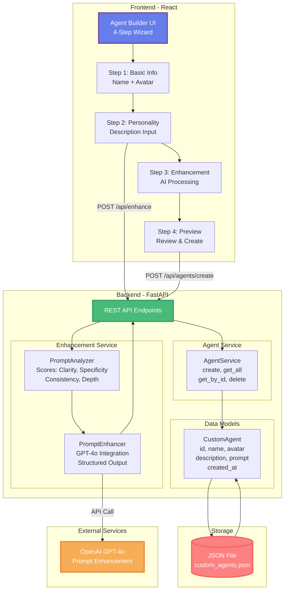
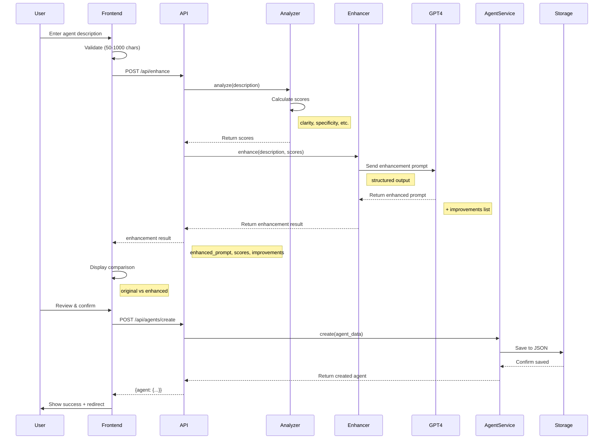
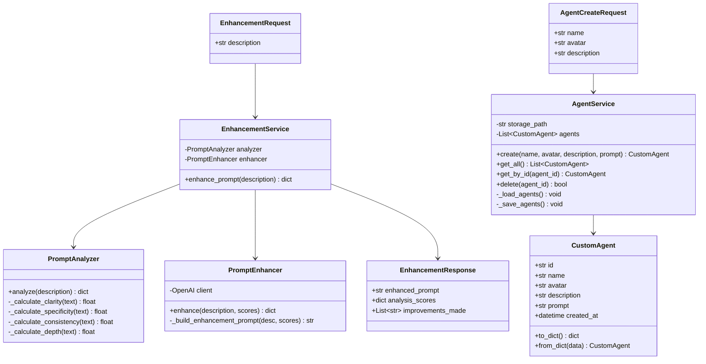
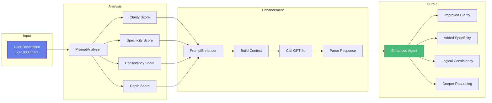
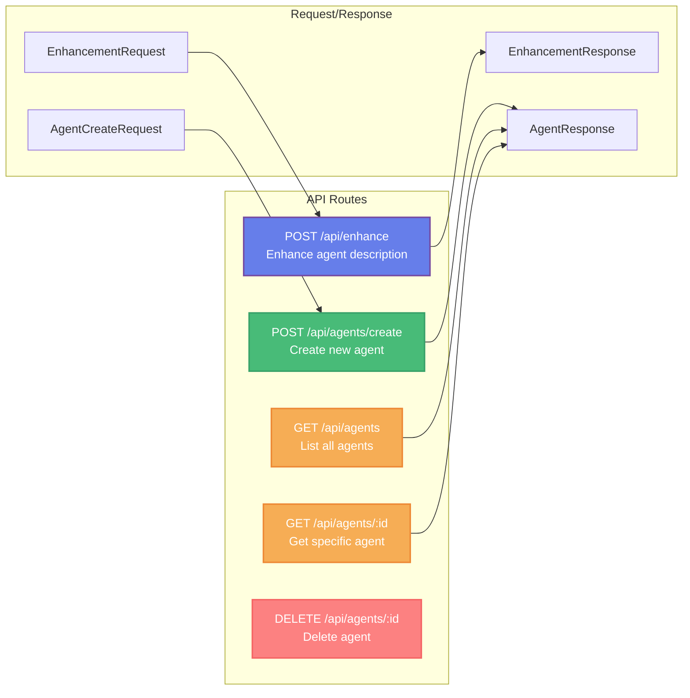

# Custom Agent Builder - System Architecture

## High-Level Architecture Diagram

```mermaid
graph TB
    subgraph Frontend["Frontend - React"]
        UI["Agent Builder UI
        4-Step Wizard"]
        Step1["Step 1: Basic Info
        Name + Avatar"]
        Step2["Step 2: Personality
        Description Input"]
        Step3["Step 3: Enhancement
        AI Processing"]
        Step4["Step 4: Preview
        Review & Create"]
        
        UI --> Step1
        Step1 --> Step2
        Step2 --> Step3
        Step3 --> Step4
    end
    
    subgraph Backend["Backend - FastAPI"]
        API[REST API Endpoints]
        
        subgraph Enhancement["Enhancement Service"]
            Analyzer["PromptAnalyzer
            Scores: Clarity, Specificity
            Consistency, Depth"]
            Enhancer["PromptEnhancer
            GPT-4o Integration
            Structured Output"]
            
            Analyzer --> Enhancer
        end
        
        subgraph AgentSvc["Agent Service"]
            CRUD["AgentService
            create, get_all
            get_by_id, delete"]
        end
        
        subgraph Models["Data Models"]
            Model["CustomAgent
            id, name, avatar
            description, prompt
            created_at"]
        end
        
        API --> Analyzer
        Enhancer --> API
        API --> CRUD
        CRUD --> Model
    end
    
    subgraph Storage
        JSON[("JSON File
        custom_agents.json")]
    end
    
    subgraph External["External Services"]
        OpenAI["OpenAI GPT-4o
        Prompt Enhancement"]
    end
    
    Step2 -->|POST /api/enhance| API
    Step4 -->|POST /api/agents/create| API
    Enhancer -->|API Call| OpenAI
    Model --> JSON
    JSON --> Model
    
    style UI fill:#667eea,stroke:#764ba2,stroke-width:3px,color:#fff
    style API fill:#48bb78,stroke:#38a169,stroke-width:3px,color:#fff
    style OpenAI fill:#f6ad55,stroke:#ed8936,stroke-width:3px,color:#fff
    style JSON fill:#fc8181,stroke:#f56565,stroke-width:3px,color:#fff
```

## Data Flow Sequence

```mermaid
sequenceDiagram
    participant User
    participant Frontend
    participant API
    participant Analyzer
    participant Enhancer
    participant GPT4
    participant AgentService
    participant Storage

    User->>Frontend: Enter agent description
    Frontend->>Frontend: Validate (50-1000 chars)
    Frontend->>API: POST /api/enhance
    
    API->>Analyzer: analyze(description)
    Analyzer->>Analyzer: Calculate scores
    Note right of Analyzer: clarity, specificity, etc.
    Analyzer-->>API: Return scores
    
    API->>Enhancer: enhance(description, scores)
    Enhancer->>GPT4: Send enhancement prompt
    Note right of Enhancer: structured output
    GPT4-->>Enhancer: Return enhanced prompt
    Note right of GPT4: + improvements list
    Enhancer-->>API: Return enhancement result
    
    API-->>Frontend: enhancement result
    Note right of API: enhanced_prompt, scores, improvements
    Frontend->>Frontend: Display comparison
    Note right of Frontend: original vs enhanced
    
    User->>Frontend: Review & confirm
    Frontend->>API: POST /api/agents/create
    
    API->>AgentService: create(agent_data)
    AgentService->>Storage: Save to JSON
    Storage-->>AgentService: Confirm saved
    AgentService-->>API: Return created agent
    
    API-->>Frontend: {agent: {...}}
    Frontend->>User: Show success + redirect
```

## Class Diagram

```mermaid
classDiagram
    class CustomAgent {
        +str id
        +str name
        +str avatar
        +str description
        +str prompt
        +datetime created_at
        +to_dict() dict
        +from_dict(data) CustomAgent
    }
    
    class AgentService {
        -str storage_path
        -List~CustomAgent~ agents
        +create(name, avatar, description, prompt) CustomAgent
        +get_all() List~CustomAgent~
        +get_by_id(agent_id) CustomAgent
        +delete(agent_id) bool
        -_load_agents() void
        -_save_agents() void
    }
    
    class PromptAnalyzer {
        +analyze(description) dict
        -_calculate_clarity(text) float
        -_calculate_specificity(text) float
        -_calculate_consistency(text) float
        -_calculate_depth(text) float
    }
    
    class PromptEnhancer {
        -OpenAI client
        +enhance(description, scores) dict
        -_build_enhancement_prompt(desc, scores) str
    }
    
    class EnhancementService {
        -PromptAnalyzer analyzer
        -PromptEnhancer enhancer
        +enhance_prompt(description) dict
    }
    
    class EnhancementRequest {
        +str description
    }
    
    class EnhancementResponse {
        +str enhanced_prompt
        +dict analysis_scores
        +List~str~ improvements_made
    }
    
    class AgentCreateRequest {
        +str name
        +str avatar
        +str description
    }
    
    EnhancementService --> PromptAnalyzer
    EnhancementService --> PromptEnhancer
    AgentService --> CustomAgent
    EnhancementRequest --> EnhancementService
    EnhancementService --> EnhancementResponse
    AgentCreateRequest --> AgentService
```

## Component Interaction Flow

```mermaid
flowchart LR
    subgraph Input
        A["User Description
        50-1000 chars"]
    end
    
    subgraph Analysis
        B[PromptAnalyzer]
        B1[Clarity Score]
        B2[Specificity Score]
        B3[Consistency Score]
        B4[Depth Score]
        
        B --> B1
        B --> B2
        B --> B3
        B --> B4
    end
    
    subgraph Enhancement
        C[PromptEnhancer]
        C1[Build Context]
        C2[Call GPT-4o]
        C3[Parse Response]
        
        C --> C1
        C1 --> C2
        C2 --> C3
    end
    
    subgraph Output
        D[Enhanced Agent]
        D1[Improved Clarity]
        D2[Added Specificity]
        D3[Logical Consistency]
        D4[Deeper Reasoning]
        
        D --> D1
        D --> D2
        D --> D3
        D --> D4
    end
    
    A --> B
    B1 --> C
    B2 --> C
    B3 --> C
    B4 --> C
    C3 --> D
    
    style A fill:#667eea,stroke:#764ba2,stroke-width:2px,color:#fff
    style D fill:#48bb78,stroke:#38a169,stroke-width:2px,color:#fff
```

## API Endpoints

```mermaid
graph LR
    subgraph Routes["API Routes"]
        E1["POST /api/enhance
        Enhance agent description"]
        E2["POST /api/agents/create
        Create new agent"]
        E3["GET /api/agents
        List all agents"]
        E4["GET /api/agents/:id
        Get specific agent"]
        E5["DELETE /api/agents/:id
        Delete agent"]
    end
    
    subgraph ReqRes["Request/Response"]
        R1[EnhancementRequest]
        R2[EnhancementResponse]
        R3[AgentCreateRequest]
        R4[AgentResponse]
    end
    
    R1 --> E1
    E1 --> R2
    R3 --> E2
    E2 --> R4
    E3 --> R4
    E4 --> R4
    
    style E1 fill:#667eea,stroke:#764ba2,stroke-width:2px,color:#fff
    style E2 fill:#48bb78,stroke:#38a169,stroke-width:2px,color:#fff
    style E3 fill:#f6ad55,stroke:#ed8936,stroke-width:2px,color:#fff
    style E4 fill:#f6ad55,stroke:#ed8936,stroke-width:2px,color:#fff
    style E5 fill:#fc8181,stroke:#f56565,stroke-width:2px,color:#fff
```

---

