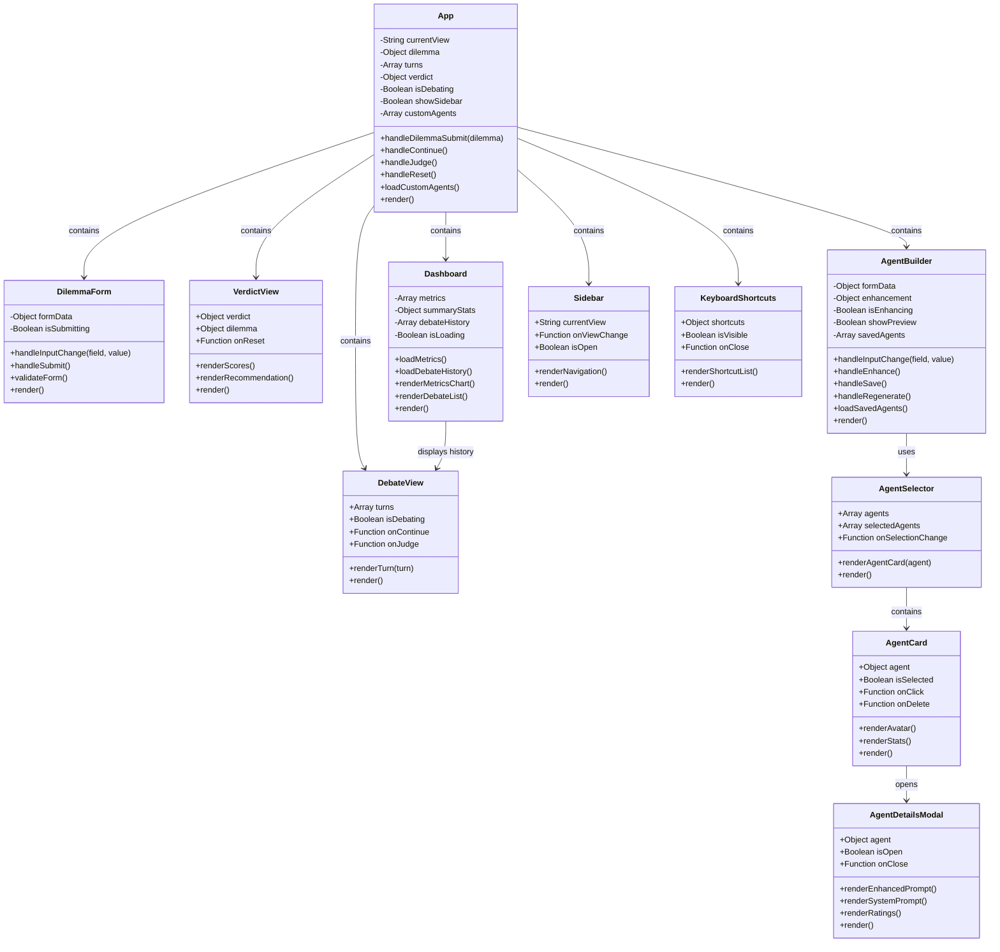

# MirrorMind AI - Complete Class Diagram

## System Architecture Overview


---

## Backend Class Diagram


---

## Frontend Component Diagram



---

## Data Flow Diagram


---

## Storage Schema

### custom_agents.json
```json
{
  "agent_id": {
    "id": "uuid",
    "name": "string",
    "avatar": "emoji",
    "description": "string",
    "enhanced_prompt": "string",
    "system_prompt": "string",
    "created_by": "string",
    "created_at": "datetime",
    "is_public": "boolean",
    "usage_count": "integer",
    "average_rating": "float",
    "rating_count": "integer"
  }
}
```

### agent_ratings.json
```json
{
  "rating_id": {
    "id": "uuid",
    "agent_id": "string",
    "debate_id": "string",
    "user_id": "string",
    "argument_quality": "1-5",
    "consistency": "1-5",
    "engagement": "1-5",
    "overall_satisfaction": "1-5",
    "comment": "string",
    "created_at": "datetime"
  }
}
```

### debate_metrics.json
```json
{
  "debates": [
    {
      "debate_id": "string",
      "timestamp": "datetime",
      "dilemma_title": "string",
      "total_turns": "integer",
      "total_words": "integer",
      "num_agents": "integer",
      "agents": ["array"],
      "avg_words_per_turn": "float",
      "avg_words_per_agent": "object",
      "agent_word_counts": "object",
      "agent_turn_counts": "object",
      "stance_changes": "object",
      "most_verbose_agent": "string",
      "intensity_score": "float",
      "final_recommendation": "A|B",
      "confidence": "0-100",
      "ethical_scores": "object"
    }
  ]
}
```

### debate_history.json
```json
[
  {
    "id": "uuid",
    "title": "string",
    "date": "datetime",
    "timestamp": "float",
    "transcript": {
      "dilemma": "object",
      "turns": "array"
    },
    "verdict": "object",
    "recommendation": "A|B",
    "confidence": "0-100"
  }
]
```

---

## API Endpoints Summary

### Debate Endpoints
- `GET /` - Health check
- `GET /health` - Health check with status
- `POST /openings` - Generate opening arguments
- `POST /agent/{agent_name}` - Get single agent response
- `POST /continue` - Continue debate with rebuttals
- `POST /judge` - Get final verdict

### Agent Management Endpoints
- `POST /api/agents/create` - Create custom agent
- `GET /api/agents` - List all agents
- `GET /api/agents/all` - Get all available agents (default + custom)
- `GET /api/agents/{agent_id}` - Get specific agent
- `PUT /api/agents/{agent_id}` - Update agent
- `DELETE /api/agents/{agent_id}` - Delete agent
- `POST /api/agents/{agent_id}/regenerate` - Regenerate agent prompt

### Enhancement Endpoints
- `POST /api/enhance` - Enhance agent description

### Metrics Endpoints
- `GET /api/metrics` - Get all debate metrics
- `GET /api/metrics/summary` - Get aggregate statistics

### History Endpoints
- `GET /api/debates` - Get debate history
- `GET /api/debates/{debate_id}` - Get specific debate
- `DELETE /api/debates/{debate_id}` - Delete debate
- `GET /api/debates/stats` - Get debate statistics

---

## Technology Stack

### Frontend
- **React 18.3+** - UI framework
- **Vite** - Build tool
- **Pure CSS** - Styling (no UI library)
- **Fetch API** - HTTP requests

### Backend
- **FastAPI** - Web framework
- **Python 3.8+** - Programming language
- **Pydantic** - Data validation
- **JSON** - Data storage

### AI Integration
- **Groq API** - Llama 3.3 70B for debates
- **OpenAI API** - GPT-4o for agent enhancement

### Deployment
- **Vercel** - Frontend hosting
- **Render** - Backend hosting
- **GitHub Actions** - CI/CD & uptime monitoring

---

## Key Design Patterns

1. **Service Layer Pattern** - Business logic separated into services
2. **Repository Pattern** - Data access abstracted through services
3. **Factory Pattern** - Agent creation through AgentService
4. **Strategy Pattern** - Different AI providers (Groq/OpenAI)
5. **Observer Pattern** - Metrics and history tracking
6. **Singleton Pattern** - Service instances in FastAPI

---

## Future Enhancements (Phase 2)

- User authentication and authorization
- PostgreSQL database migration
- Custom agents in live debates
- Agent marketplace
- Real-time debate streaming
- Multi-language support
- Advanced analytics dashboard
