# MirrorMind AI - Feature Architecture Diagrams

**Complete architecture and data flow diagrams based on actual code implementation**

---

## Table of Contents

1. [AI Debate Arena](#1-ai-debate-arena)
2. [Custom Agent Builder](#2-custom-agent-builder)
3. [Debate Library & Deduplication](#3-debate-library--deduplication)
4. [Judge System](#4-judge-system)
5. [Analytics Dashboard](#5-analytics-dashboard)
6. [Debate History & Replay](#6-debate-history--replay)
7. [PDF Export](#7-pdf-export)

---

## 1. AI Debate Arena

### 1.1 Component Architecture (Frontend)

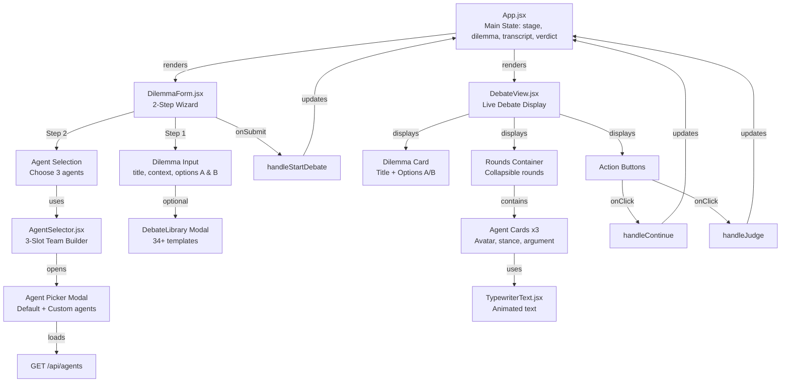

**Clean Component Flow:**
- App.jsx manages all state and renders DilemmaForm or DebateView based on stage
- DilemmaForm is a 2-step wizard: dilemma input → agent selection
- AgentSelector loads agents and provides 3-slot team builder
- DebateView displays rounds with agent cards using TypewriterText for animation
- All actions flow back to App.jsx to update state

### 1.2 System Architecture (Full Stack)

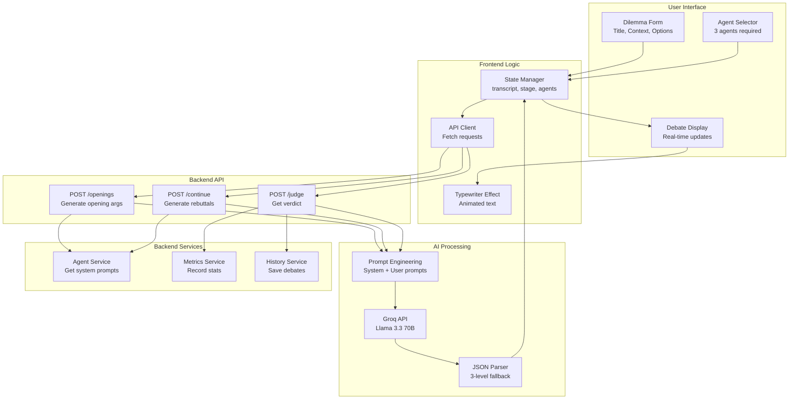

### 1.2 Data Flow - Opening Arguments (ACTUAL CODE)

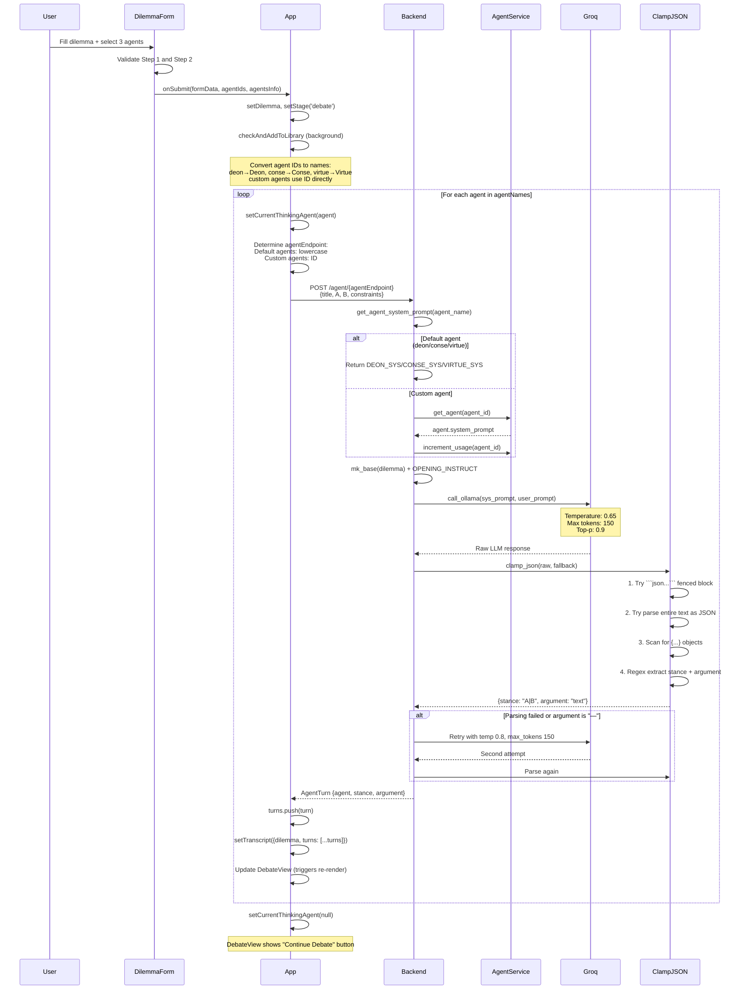

**Actual Opening Arguments Flow:**
1. User completes 2-step wizard in DilemmaForm
2. DilemmaForm calls `onSubmit(formData, agentIds, agentsInfo)`
3. App.jsx `handleStartDebate()`:
   - Sets dilemma and stage to 'debate'
   - Calls `checkAndAddToLibrary()` in background
   - Converts agent IDs: default agents to lowercase, custom agents keep ID
4. **Loops through each agent sequentially:**
   - Sets `currentThinkingAgent` (shows spinner)
   - Determines endpoint: `deon`→`/agent/deon`, custom→`/agent/{uuid}`
   - POST to `/agent/{agentEndpoint}` with dilemma
5. Backend `single_agent()`:
   - Calls `get_agent_system_prompt()` (returns default or custom prompt)
   - For custom agents: increments usage count
   - Builds prompt: `mk_base(dilemma) + OPENING_INSTRUCT`
   - Calls Groq via `call_ollama()` (temp 0.65, max_tokens 150)
6. Response parsing via `clamp_json()` (4-level fallback)
7. If parsing fails, retry with temp 0.8
8. Returns `AgentTurn {agent, stance, argument}`
9. App appends to turns array and updates transcript
10. DebateView re-renders with TypewriterText animation
```
            Groq-->>API: Second attempt
            API->>JSONParser: Parse again
        end
        API-->>Frontend: AgentTurn object
        Frontend->>Frontend: Append to transcript
        Frontend->>User: Display with typewriter effect
```

### 1.3 Data Flow - Rebuttal Round

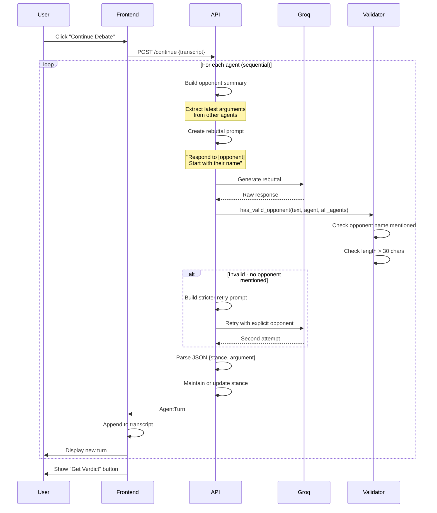

### 1.4 Component Architecture

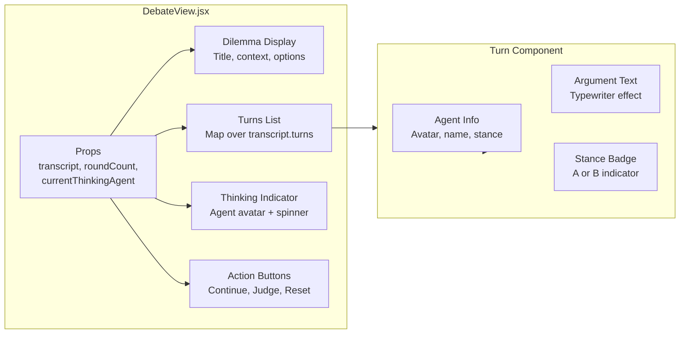

---

## 2. Custom Agent Builder

### 2.1 System Architecture

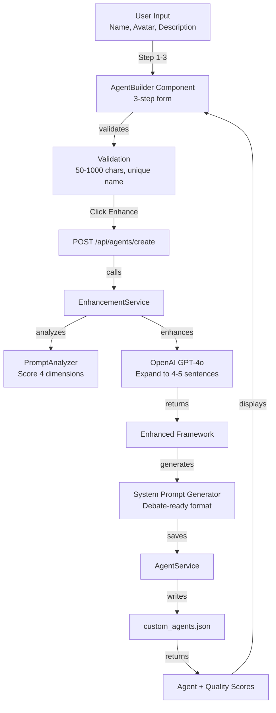

**Clean Flow:**
- User fills 3-step form (name, avatar, description)
- Frontend validates inputs
- Backend calls EnhancementService
- PromptAnalyzer scores quality (4 dimensions)
- GPT-4o expands description to 4-5 sentences
- System prompt generated for debates
- AgentService saves to JSON with atomic write
- Quality scores displayed to user
```

### 2.2 Data Flow - Agent Creation

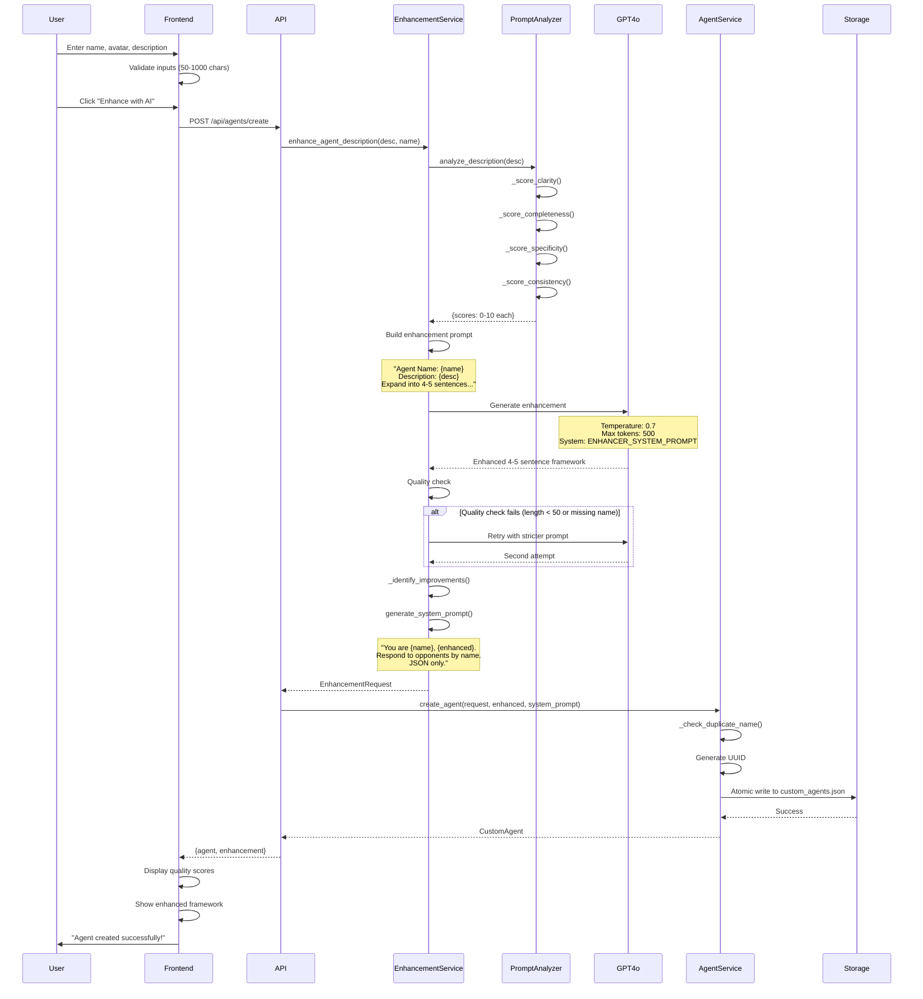


### 2.3 Quality Scoring Algorithm

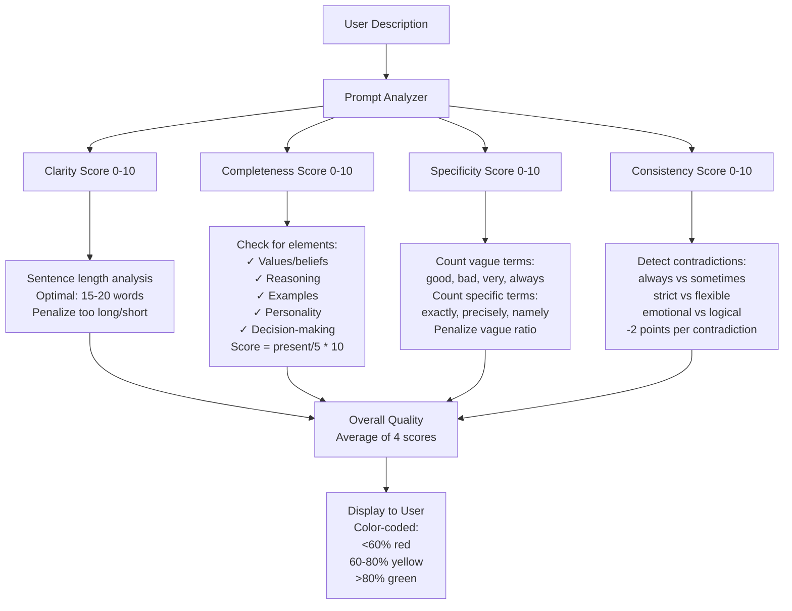

---

## 3. Debate Library & Deduplication

### 3.1 Frontend Architecture

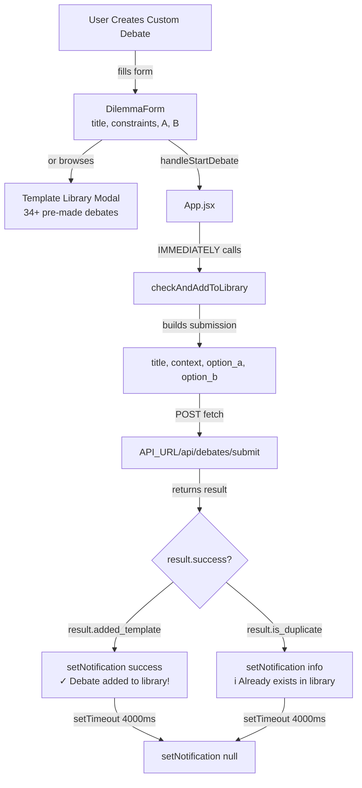

**Actual Frontend Flow:**
1. User fills DilemmaForm (title, constraints, A, B)
2. On submit → `handleStartDebate()` in App.jsx
3. **IMMEDIATELY** calls `checkAndAddToLibrary(dilemmaData)` in background
4. Builds submission object: `{title, context: constraints, option_a: A, option_b: B}`
5. POST to `/api/debates/submit`
6. If `result.success && result.added_template` → success toast
7. If `result.is_duplicate` → info toast
8. Toast auto-clears after 4 seconds

### 3.2 Backend Architecture

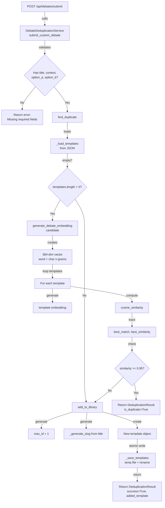

**Actual Backend Flow:**
1. Receives POST with `{title, context, option_a, option_b}`
2. `DebateDeduplicationService.submit_custom_debate()` validates fields
3. Calls `find_duplicate()`:
   - Loads all templates from JSON
   - Generates 384-dim embedding for candidate (hash-based: word + char n-grams)
   - Loops through ALL templates
   - Generates embedding for each template
   - Computes cosine similarity
   - Tracks best match
4. If `best_similarity >= 0.95` → duplicate found, return it
5. If `best_similarity < 0.95` → unique debate:
   - Generate new ID (max existing ID + 1)
   - Generate slug from title
   - Create template object with `is_custom: true`
   - Atomic write (temp file → rename)
6. Return `DeduplicationResult` with success/duplicate status
```


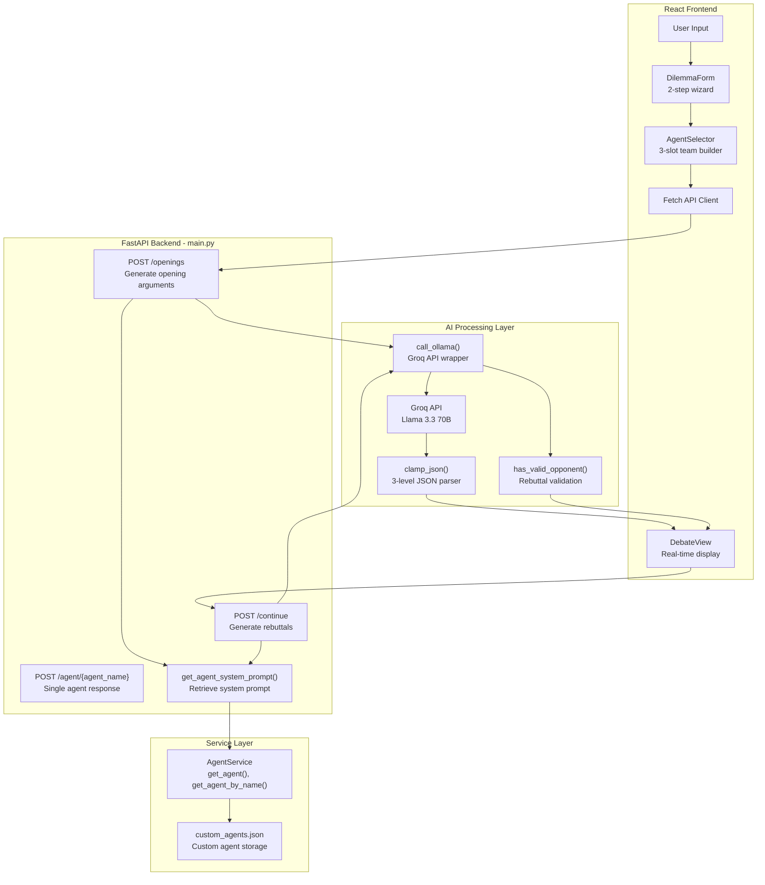

### 1.3 Data Flow - Opening Arguments (ACTUAL CODE)

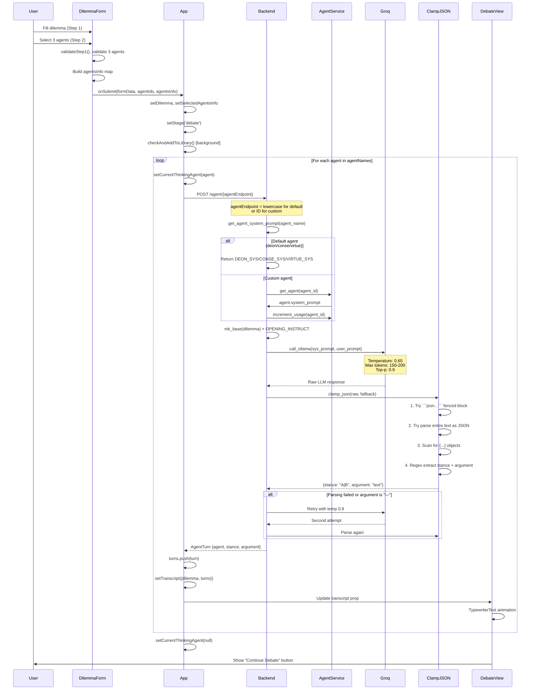
