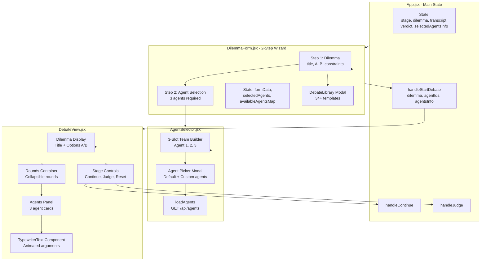
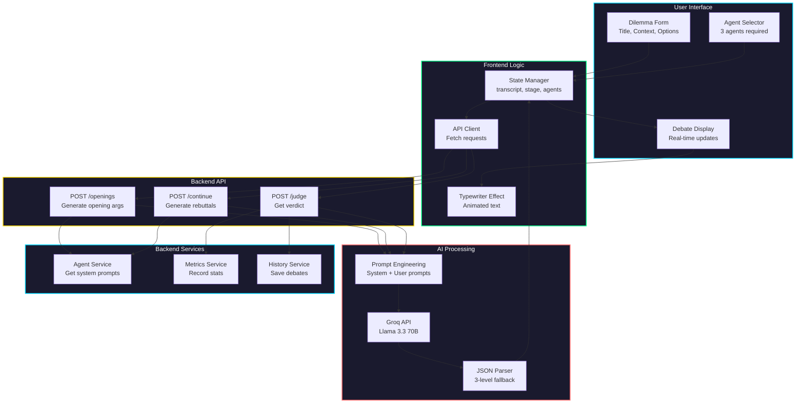
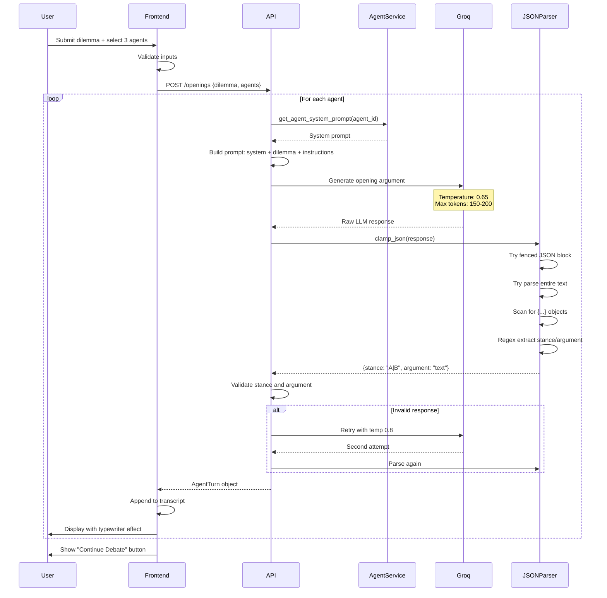
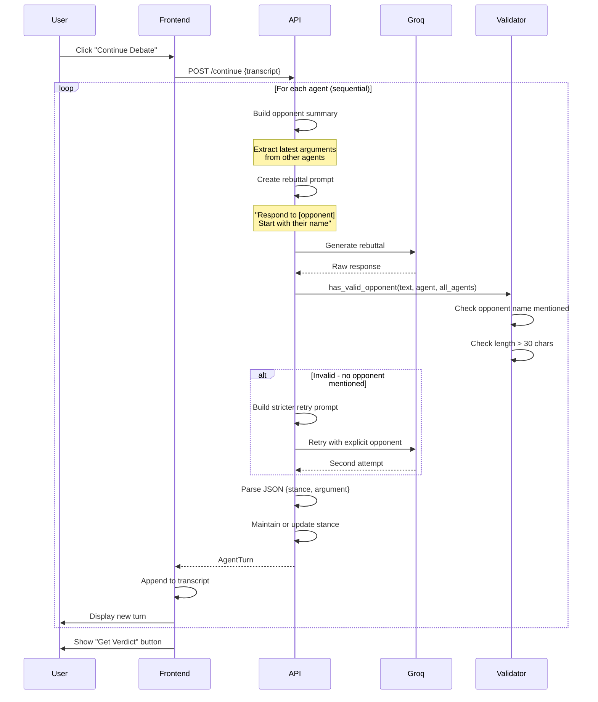
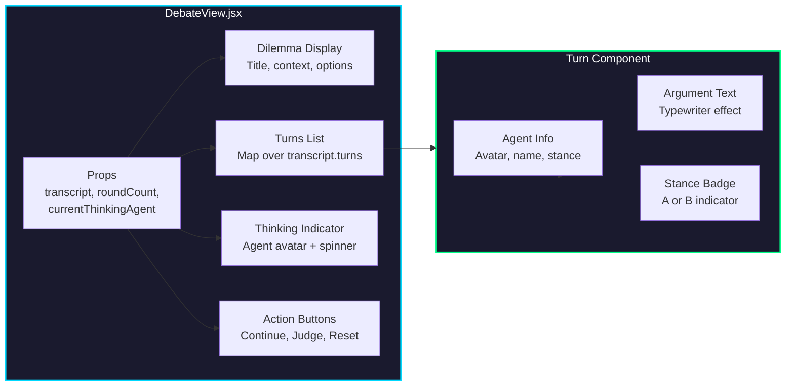
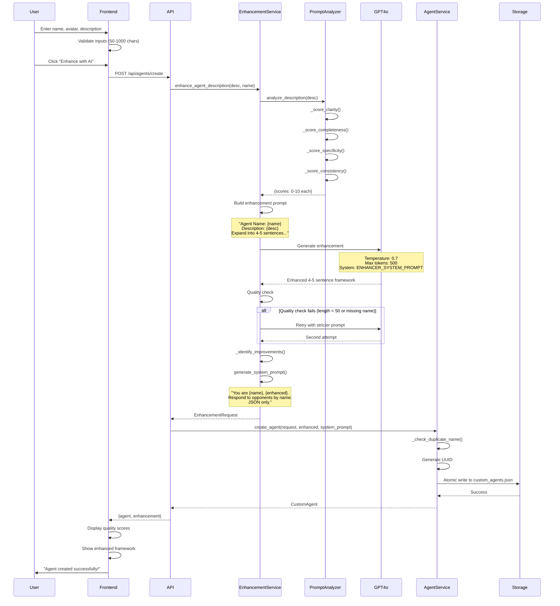
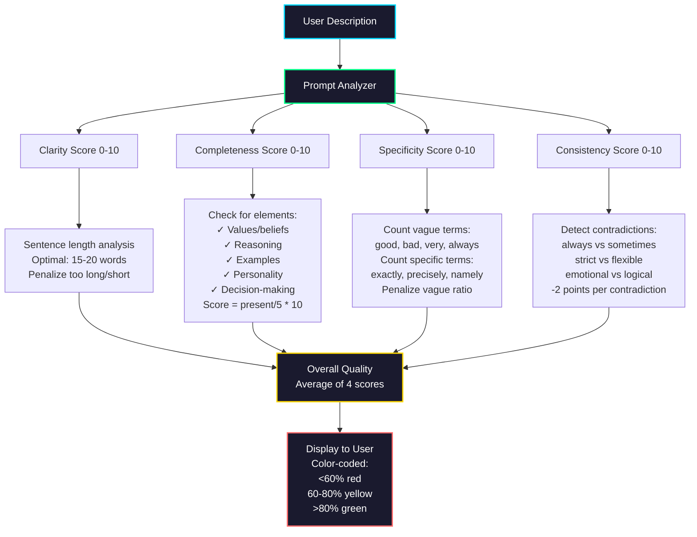
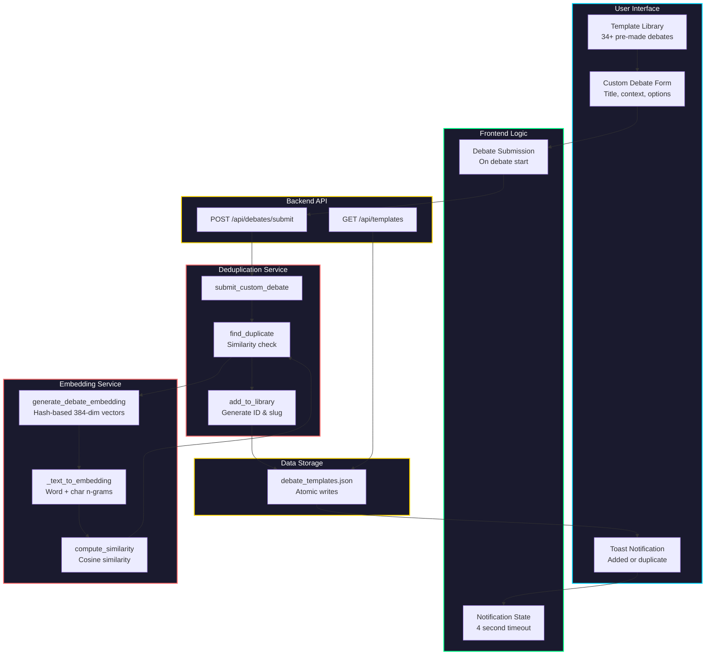
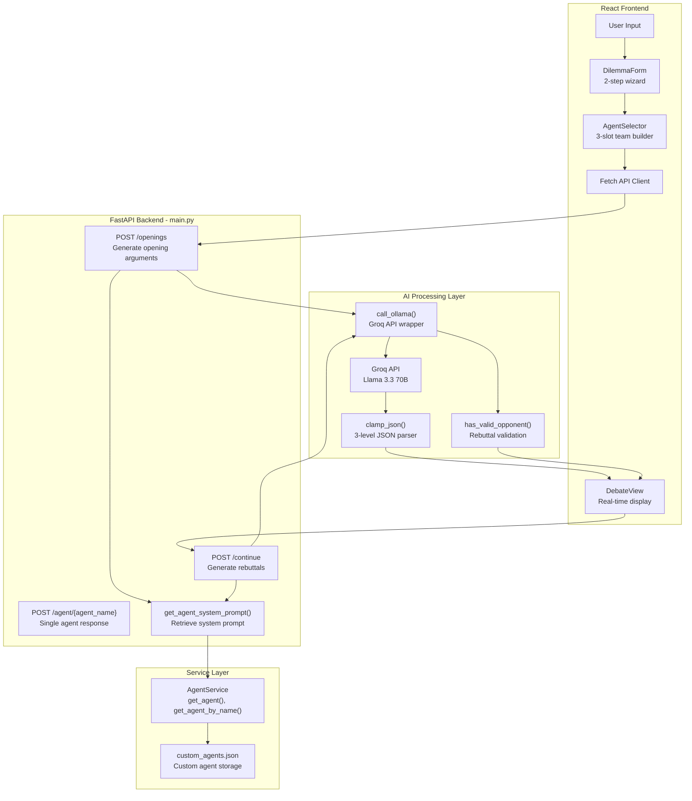
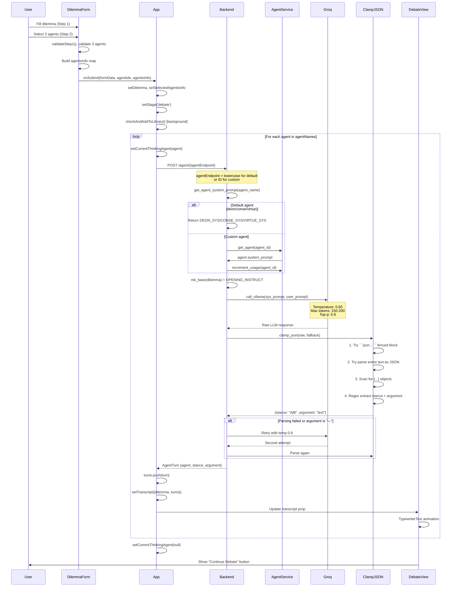

# MirrorMind AI - Feature Architecture Diagrams

**Complete architecture and data flow diagrams based on actual code implementation**

---

## Table of Contents

1. [AI Debate Arena](#1-ai-debate-arena)
2. [Custom Agent Builder](#2-custom-agent-builder)
3. [Debate Library & Deduplication](#3-debate-library--deduplication)
4. [Judge System](#4-judge-system)
5. [Analytics Dashboard](#5-analytics-dashboard)
6. [Debate History & Replay](#6-debate-history--replay)
7. [PDF Export](#7-pdf-export)

---

## 1. AI Debate Arena

### 1.1 Component Architecture (Frontend)



### 1.2 System Architecture (Full Stack)



### 1.2 Data Flow - Opening Arguments




### 1.3 Data Flow - Rebuttal Round



### 1.4 Component Architecture



---

## 2. Custom Agent Builder

### 2.1 System Architecture

```mermaid
graph TB
    subgraph UI["User Interface"]
        Step1[Step 1: Name<br/>3-50 chars, unique]
        Step2[Step 2: Avatar<br/>32 emoji options]
        Step3[Step 3: Description<br/>50-1000 chars]
        EnhanceBtn[Enhance Button<br/>Trigger GPT-4o]
        QualityDisplay[Quality Display<br/>4 dimension scores]
        PreviewPanel[Preview Panel<br/>Enhanced framework]
    end
    
    subgraph Frontend["Frontend Logic"]
        FormState[Form State<br/>name, avatar, description]
        ValidationLogic[Validation Logic<br/>Character counts, uniqueness]
        APIClient[API Client<br/>POST /api/agents/create]
    end
    
    subgraph Backend["Backend API"]
        CreateEndpoint[POST /api/agents/create]
        EnhanceEndpoint[POST /api/enhance]
        RegenerateEndpoint[POST /api/agents/{id}/regenerate]
    end
    
    subgraph EnhancementPipeline["Enhancement Pipeline"]
        EnhancementService[Enhancement Service]
        PromptAnalyzer[Prompt Analyzer<br/>Score 4 dimensions]
        PromptEnhancer[Prompt Enhancer<br/>GPT-4o expansion]
        SystemPromptGen[System Prompt Generator<br/>Debate-ready format]
    end
    
    subgraph AI["AI Integration"]
        GPT4o[OpenAI GPT-4o<br/>Temperature: 0.7<br/>Max tokens: 500]
    end
    
    subgraph Storage["Data Storage"]
        AgentService[Agent Service]
        AgentsJSON[custom_agents.json<br/>Atomic writes]
    end
    
    Step1 --> FormState
    Step2 --> FormState
    Step3 --> FormState
    FormState --> ValidationLogic
    ValidationLogic --> EnhanceBtn
    EnhanceBtn --> APIClient
    APIClient --> CreateEndpoint
    
    CreateEndpoint --> EnhancementService
    EnhancementService --> PromptAnalyzer
    EnhancementService --> PromptEnhancer
    PromptEnhancer --> GPT4o
    GPT4o --> PromptEnhancer
    PromptEnhancer --> SystemPromptGen
    SystemPromptGen --> AgentService
    AgentService --> AgentsJSON
    
    AgentService --> QualityDisplay
    AgentService --> PreviewPanel
    
    style UI fill:#1a1a2e,stroke:#00d9ff,stroke-width:2px,color:#fff
    style Frontend fill:#1a1a2e,stroke:#00ff88,stroke-width:2px,color:#fff
    style Backend fill:#1a1a2e,stroke:#ffd700,stroke-width:2px,color:#fff
    style EnhancementPipeline fill:#1a1a2e,stroke:#ff6b6b,stroke-width:2px,color:#fff
    style AI fill:#1a1a2e,stroke:#ff6b6b,stroke-width:2px,color:#fff
    style Storage fill:#1a1a2e,stroke:#ffd700,stroke-width:2px,color:#fff
```

### 2.2 Data Flow - Agent Creation




### 2.3 Quality Scoring Algorithm



---

## 3. Debate Library & Deduplication

### 3.1 System Architecture






### 1.3 Data Flow - Opening Arguments (ACTUAL CODE)


