# MirrorMind AI - Feature Architecture Diagrams

**Complete architecture and data flow diagrams based on actual code implementation**

---

## Table of Contents

1. [AI Debate Arena](#1-ai-debate-arena)
2. [Custom Agent Builder](#2-custom-agent-builder)
3. [Debate Library & Deduplication](#3-debate-library--deduplication)
4. [Judge System](#4-judge-system)
5. [Analytics Dashboard](#5-analytics-dashboard)
6. [Debate History & Replay](#6-debate-history--replay)
7. [PDF Export](#7-pdf-export)

---

## 1. AI Debate Arena

**How It Works:**

**Step 1: User Input** - User fills 2-step wizard (dilemma details → select 3 agents). AgentSelector loads available agents via GET /api/agents. Optional: browse 34+ templates from DebateLibrary.

**Step 2: Initialization** - DilemmaForm validates and calls handleStartDebate(). App.jsx sets dilemma, stage='debate', and calls checkAndAddToLibrary() in background. Agent IDs converted: defaults to lowercase, custom keep UUID.

**Step 3: Opening Arguments** - App.jsx loops through agents sequentially. For each: shows spinner, POSTs to /agent/{endpoint}. Backend retrieves system prompt, builds prompt with mk_base(dilemma) + OPENING_INSTRUCT, calls Groq (temp 0.65, max_tokens 150). Response parsed via clamp_json() with 4-level fallback. Retry with temp 0.8 if parsing fails. Returns AgentTurn {agent, stance, argument}.

**Step 4: Display** - App.jsx appends turns to transcript, updates DebateView. TypewriterText animates each argument. User clicks "Continue Debate" for rebuttals.

**Step 5: Rebuttals** - Similar flow but backend builds opponent summary. Validates with has_valid_opponent() to ensure agents address each other. Retries with stricter prompt if validation fails.

**Step 6: Verdict** - User clicks "Get Verdict" → POST /judge. Backend builds judge prompt, calls Groq (temp 0.3, max_tokens 800) for verdict with 5-dimensional ethical scores. MetricsService calculates stats (word counts, stance changes, intensity). DebateHistoryService saves with UUID. VerdictView displays recommendation, confidence, reasoning, and scores.

### 1.1 Class Diagram

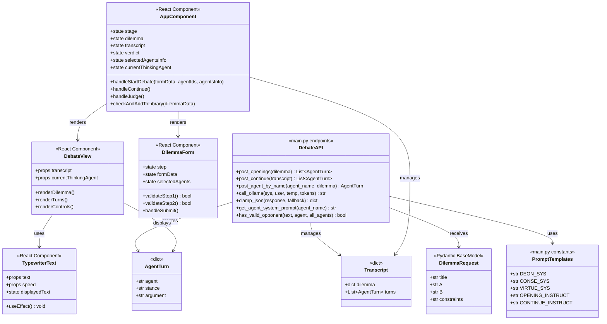
```mermaid
classDiagram
    class DilemmaRequest {
        <<Pydantic BaseModel>>
        +str title
        +str A
        +str B
        +str constraints
    }
    
    class AgentTurn {
        <<dict>>
        +str agent
        +str stance
        +str argument
    }
    
    class Transcript {
        <<dict>>
        +dict dilemma
        +List~AgentTurn~ turns
    }
    
    class DebateAPI {
        <<main.py endpoints>>
        +post_openings(dilemma) List~AgentTurn~
        +post_continue(transcript) List~AgentTurn~
        +post_agent_by_name(agent_name, dilemma) AgentTurn
        +call_ollama(sys, user, temp, tokens) str
        +clamp_json(response, fallback) dict
        +get_agent_system_prompt(agent_name) str
        +has_valid_opponent(text, agent, all_agents) bool
    }
    
    class PromptTemplates {
        <<main.py constants>>
        +str DEON_SYS
        +str CONSE_SYS
        +str VIRTUE_SYS
        +str OPENING_INSTRUCT
        +str CONTINUE_INSTRUCT
    }
    
    class AppComponent {
        <<React Component>>
        +state stage
        +state dilemma
        +state transcript
        +state verdict
        +state selectedAgentsInfo
        +state currentThinkingAgent
        +handleStartDebate(formData, agentIds, agentsInfo)
        +handleContinue()
        +handleJudge()
        +checkAndAddToLibrary(dilemmaData)
    }
    
    class DilemmaForm {
        <<React Component>>
        +state step
        +state formData
        +state selectedAgents
        +validateStep1() bool
        +validateStep2() bool
        +handleSubmit()
    }
    
    class DebateView {
        <<React Component>>
        +props transcript
        +props currentThinkingAgent
        +renderDilemma()
        +renderTurns()
        +renderControls()
    }
    
    class TypewriterText {
        <<React Component>>
        +props text
        +props speed
        +state displayedText
        +useEffect() void
    }
    
    DebateAPI --> DilemmaRequest : receives
    DebateAPI --> Transcript : manages
    DebateAPI --> AgentTurn : creates
    DebateAPI --> PromptTemplates : uses
    
    AppComponent --> DilemmaForm : renders
    AppComponent --> DebateView : renders
    AppComponent --> Transcript : manages
    
    DebateView --> TypewriterText : uses
    DebateView --> AgentTurn : displays
```

### 1.2 Component Architecture (Frontend)

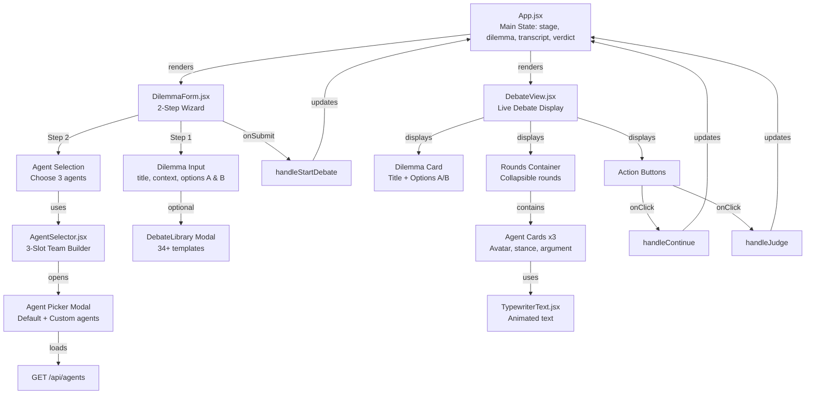
```mermaid
graph TD
    App[App.jsx<br/>Main State: stage, dilemma, transcript, verdict]
    
    App -->|renders| DilemmaForm[DilemmaForm.jsx<br/>2-Step Wizard]
    App -->|renders| DebateView[DebateView.jsx<br/>Live Debate Display]
    
    DilemmaForm -->|Step 1| Step1[Dilemma Input<br/>title, context, options A & B]
    DilemmaForm -->|Step 2| Step2[Agent Selection<br/>Choose 3 agents]
    
    Step2 -->|uses| AgentSelector[AgentSelector.jsx<br/>3-Slot Team Builder]
    AgentSelector -->|opens| AgentPicker[Agent Picker Modal<br/>Default + Custom agents]
    AgentPicker -->|loads| LoadAgents[GET /api/agents]
    
    Step1 -->|optional| DebateLibrary[DebateLibrary Modal<br/>34+ templates]
    
    DilemmaForm -->|onSubmit| HandleStart[handleStartDebate]
    HandleStart -->|updates| App
    
    DebateView -->|displays| DilemmaCard[Dilemma Card<br/>Title + Options A/B]
    DebateView -->|displays| Rounds[Rounds Container<br/>Collapsible rounds]
    Rounds -->|contains| AgentCards[Agent Cards x3<br/>Avatar, stance, argument]
    AgentCards -->|uses| Typewriter[TypewriterText.jsx<br/>Animated text]
    
    DebateView -->|displays| Controls[Action Buttons]
    Controls -->|onClick| HandleContinue[handleContinue]
    Controls -->|onClick| HandleJudge[handleJudge]
    HandleContinue -->|updates| App
    HandleJudge -->|updates| App
```

### 1.3 System Architecture (Full Stack)

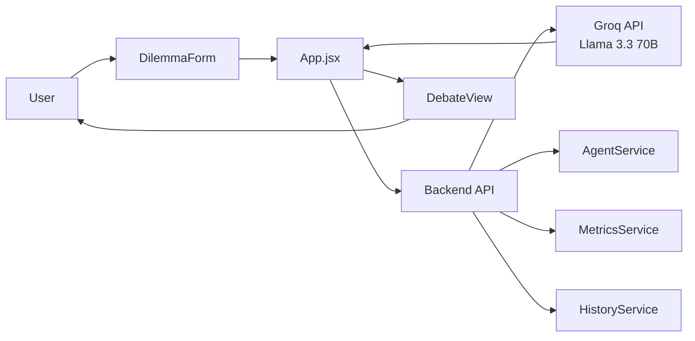
```mermaid
graph LR
    User[User] --> DilemmaForm[DilemmaForm]
    DilemmaForm --> App[App.jsx]
    
    App --> API[Backend API]
    API --> Groq[Groq API<br/>Llama 3.3 70B]
    
    API --> AgentService[AgentService]
    API --> MetricsService[MetricsService]
    API --> HistoryService[HistoryService]
    
    Groq --> App
    App --> DebateView[DebateView]
    DebateView --> User
```

### 1.4 Data Flow - Opening Arguments

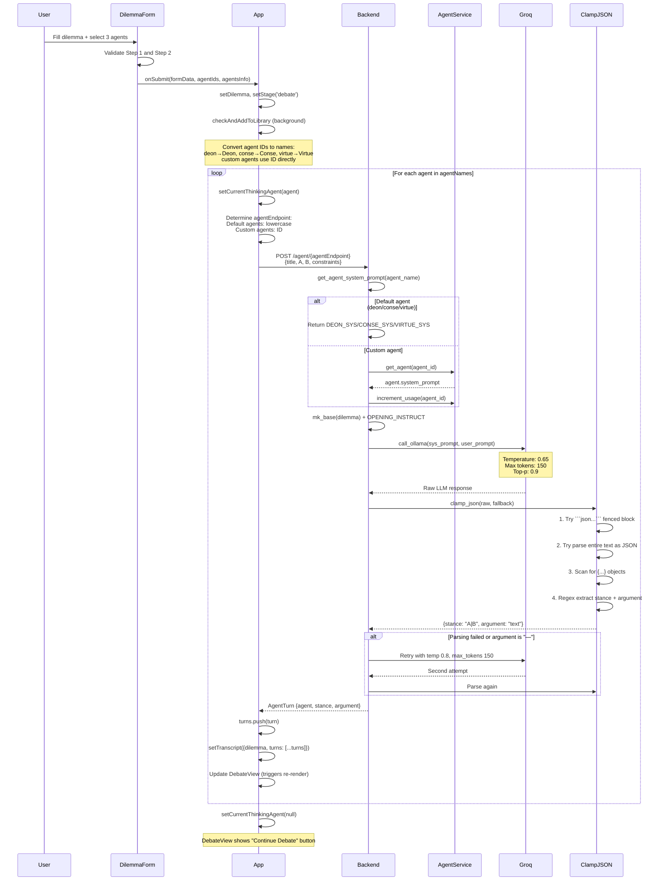
```mermaid
sequenceDiagram
    participant User
    participant DilemmaForm
    participant App
    participant Backend
    participant AgentService
    participant Groq
    participant ClampJSON
    
    User->>DilemmaForm: Fill dilemma + select 3 agents
    DilemmaForm->>DilemmaForm: Validate Step 1 and Step 2
    DilemmaForm->>App: onSubmit(formData, agentIds, agentsInfo)
    
    App->>App: setDilemma, setStage('debate')
    App->>App: checkAndAddToLibrary (background)
    
    Note over App: Convert agent IDs to names:<br/>deon→Deon, conse→Conse, virtue→Virtue<br/>custom agents use ID directly
    
    loop For each agent in agentNames
        App->>App: setCurrentThinkingAgent(agent)
        
        App->>App: Determine agentEndpoint:<br/>Default agents: lowercase<br/>Custom agents: ID
        
        App->>Backend: POST /agent/{agentEndpoint}<br/>{title, A, B, constraints}
        
        Backend->>Backend: get_agent_system_prompt(agent_name)
        
        alt Default agent (deon/conse/virtue)
            Backend->>Backend: Return DEON_SYS/CONSE_SYS/VIRTUE_SYS
        else Custom agent
            Backend->>AgentService: get_agent(agent_id)
            AgentService-->>Backend: agent.system_prompt
            Backend->>AgentService: increment_usage(agent_id)
        end
        
        Backend->>Backend: mk_base(dilemma) + OPENING_INSTRUCT
        Backend->>Groq: call_ollama(sys_prompt, user_prompt)
        Note over Groq: Temperature: 0.65<br/>Max tokens: 150<br/>Top-p: 0.9
        Groq-->>Backend: Raw LLM response
        
        Backend->>ClampJSON: clamp_json(raw, fallback)
        ClampJSON->>ClampJSON: 1. Try ```json...``` fenced block
        ClampJSON->>ClampJSON: 2. Try parse entire text as JSON
        ClampJSON->>ClampJSON: 3. Scan for {...} objects
        ClampJSON->>ClampJSON: 4. Regex extract stance + argument
        ClampJSON-->>Backend: {stance: "A|B", argument: "text"}
        
        alt Parsing failed or argument is "—"
            Backend->>Groq: Retry with temp 0.8, max_tokens 150
            Groq-->>Backend: Second attempt
            Backend->>ClampJSON: Parse again
        end
        
        Backend-->>App: AgentTurn {agent, stance, argument}
        App->>App: turns.push(turn)
        App->>App: setTranscript({dilemma, turns: [...turns]})
        App->>App: Update DebateView (triggers re-render)
    end
    
    App->>App: setCurrentThinkingAgent(null)
    Note over App: DebateView shows "Continue Debate" button
```

### 1.5 Data Flow - Rebuttal Round

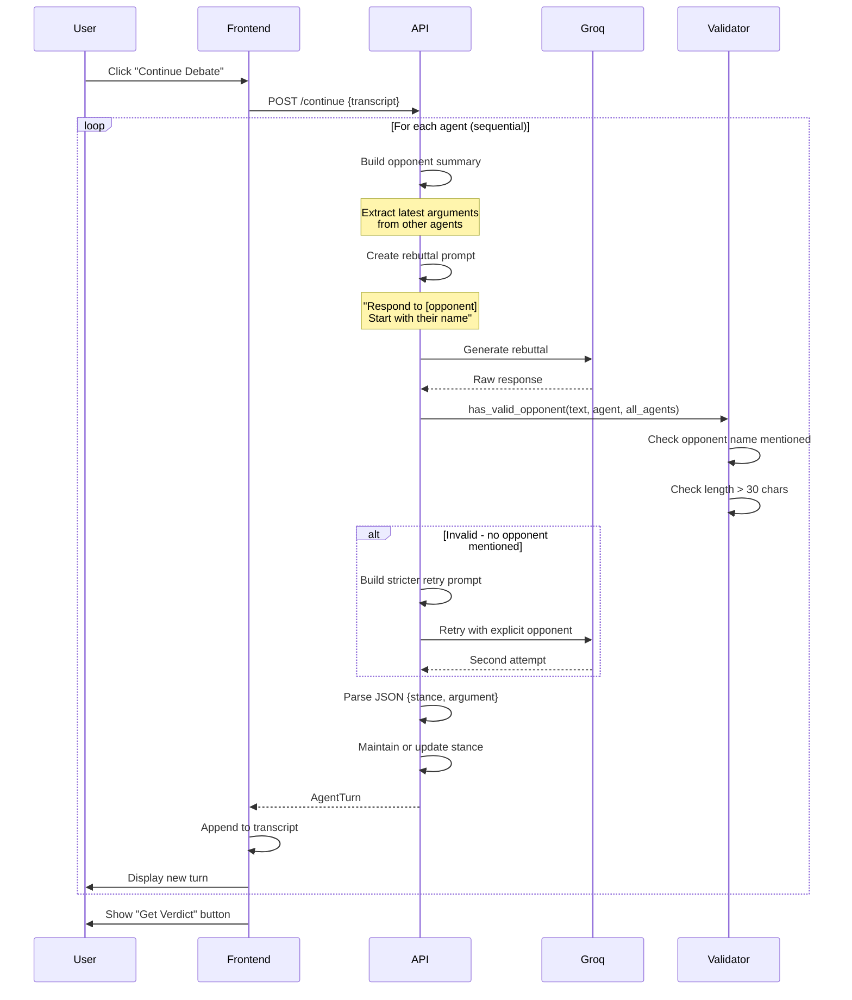
```mermaid
sequenceDiagram
    participant User
    participant Frontend
    participant API
    participant Groq
    participant Validator
    
    User->>Frontend: Click "Continue Debate"
    Frontend->>API: POST /continue {transcript}
    
    loop For each agent (sequential)
        API->>API: Build opponent summary
        Note over API: Extract latest arguments<br/>from other agents
        API->>API: Create rebuttal prompt
        Note over API: "Respond to [opponent]<br/>Start with their name"
        API->>Groq: Generate rebuttal
        Groq-->>API: Raw response
        API->>Validator: has_valid_opponent(text, agent, all_agents)
        Validator->>Validator: Check opponent name mentioned
        Validator->>Validator: Check length > 30 chars
        alt Invalid - no opponent mentioned
            API->>API: Build stricter retry prompt
            API->>Groq: Retry with explicit opponent
            Groq-->>API: Second attempt
        end
        API->>API: Parse JSON {stance, argument}
        API->>API: Maintain or update stance
        API-->>Frontend: AgentTurn
        Frontend->>Frontend: Append to transcript
        Frontend->>User: Display new turn
    end
    
    Frontend->>User: Show "Get Verdict" button
```

### 1.6 Component Architecture

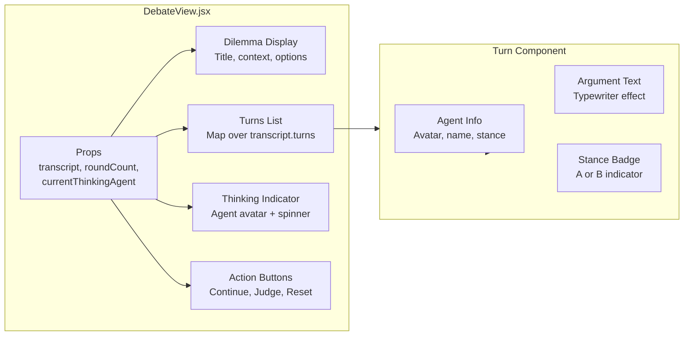
```mermaid
graph LR
    subgraph DebateView["DebateView.jsx"]
        Props[Props<br/>transcript, roundCount,<br/>currentThinkingAgent]
        DilemmaDisplay[Dilemma Display<br/>Title, context, options]
        TurnsList[Turns List<br/>Map over transcript.turns]
        ThinkingIndicator[Thinking Indicator<br/>Agent avatar + spinner]
        ActionButtons[Action Buttons<br/>Continue, Judge, Reset]
    end
    
    subgraph TurnComponent["Turn Component"]
        AgentInfo[Agent Info<br/>Avatar, name, stance]
        ArgumentText[Argument Text<br/>Typewriter effect]
        StanceBadge[Stance Badge<br/>A or B indicator]
    end
    
    Props --> DilemmaDisplay
    Props --> TurnsList
    Props --> ThinkingIndicator
    Props --> ActionButtons
    
    TurnsList --> TurnComponent
    TurnComponent --> AgentInfo
    TurnComponent --> ArgumentText
    TurnComponent --> StanceBadge
```

---

## 2. Custom Agent Builder

**How It Works:**

**Step 1: Basic Info** - User enters name (1-50 chars, unique), avatar emoji, description (50-1000 chars). Frontend validates against default agents and existing custom agents.

**Step 2: Quality Analysis** - User clicks "Enhance with AI" → POST /api/agents/create. PromptAnalyzer scores description: Clarity (sentence length), Completeness (values/reasoning/examples), Specificity (vague vs specific terms), Consistency (contradictions). Each scored 0-10.

**Step 3: GPT-4o Enhancement** - PromptEnhancer calls OpenAI GPT-4o (temp 0.7, max_tokens 500) to expand description into 4-5 sentences. Must incorporate agent name, elaborate beliefs, describe reasoning framework, explain debate application, acknowledge nuances. Quality check: if <50 words or missing name, retries with temp 0.75.

**Step 4: System Prompt** - EnhancementService generates debate-ready format: "You are {name}, {enhanced}. Respond to opponents by name. JSON only." Preserves original name by removing JSON fields.

**Step 5: Storage** - AgentService generates UUID, checks duplicates, creates CustomAgent. Atomic write to custom_agents.json (temp file → rename). Returns agent with quality scores. Color-coded display: <60% red, 60-80% yellow, >80% green.

**Step 6: Usage Tracking** - increment_usage() updates count when agent debates. Users rate agents (quality, consistency, engagement, satisfaction). _update_agent_rating() recalculates average from all ratings.

### 2.1 Class Diagram

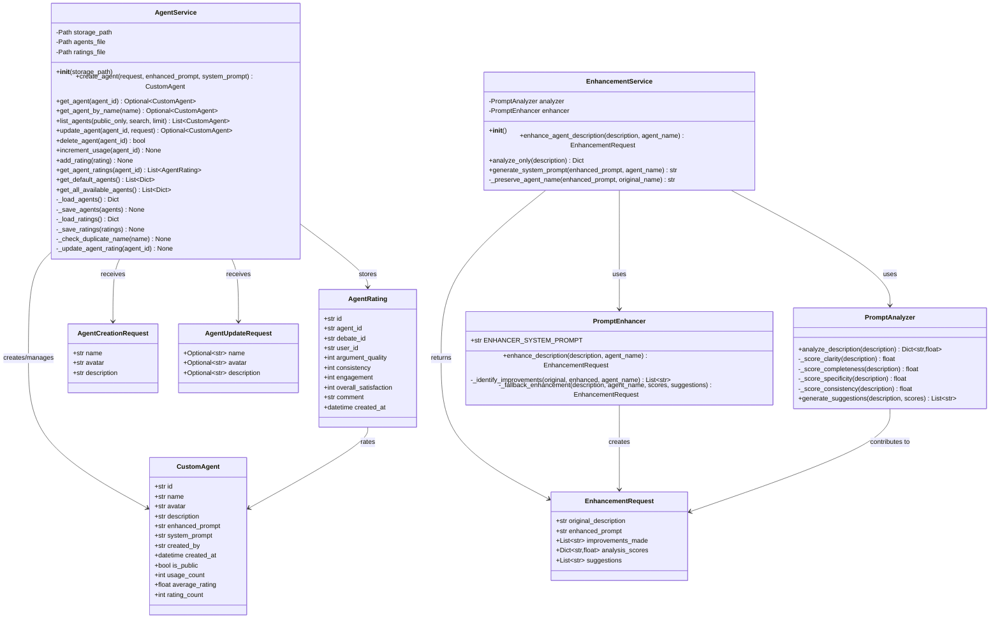
```mermaid
classDiagram
    class CustomAgent {
        +str id
        +str name
        +str avatar
        +str description
        +str enhanced_prompt
        +str system_prompt
        +str created_by
        +datetime created_at
        +bool is_public
        +int usage_count
        +float average_rating
        +int rating_count
    }
    
    class AgentRating {
        +str id
        +str agent_id
        +str debate_id
        +str user_id
        +int argument_quality
        +int consistency
        +int engagement
        +int overall_satisfaction
        +str comment
        +datetime created_at
    }
    
    class EnhancementRequest {
        +str original_description
        +str enhanced_prompt
        +List~str~ improvements_made
        +Dict~str,float~ analysis_scores
        +List~str~ suggestions
    }
    
    class AgentCreationRequest {
        +str name
        +str avatar
        +str description
    }
    
    class AgentUpdateRequest {
        +Optional~str~ name
        +Optional~str~ avatar
        +Optional~str~ description
    }
    
    class AgentService {
        -Path storage_path
        -Path agents_file
        -Path ratings_file
        +__init__(storage_path)
        +create_agent(request, enhanced_prompt, system_prompt) CustomAgent
        +get_agent(agent_id) Optional~CustomAgent~
        +get_agent_by_name(name) Optional~CustomAgent~
        +list_agents(public_only, search, limit) List~CustomAgent~
        +update_agent(agent_id, request) Optional~CustomAgent~
        +delete_agent(agent_id) bool
        +increment_usage(agent_id) None
        +add_rating(rating) None
        +get_agent_ratings(agent_id) List~AgentRating~
        +get_default_agents() List~Dict~
        +get_all_available_agents() List~Dict~
        -_load_agents() Dict
        -_save_agents(agents) None
        -_load_ratings() Dict
        -_save_ratings(ratings) None
        -_check_duplicate_name(name) None
        -_update_agent_rating(agent_id) None
    }
    
    class PromptAnalyzer {
        +analyze_description(description) Dict~str,float~
        -_score_clarity(description) float
        -_score_completeness(description) float
        -_score_specificity(description) float
        -_score_consistency(description) float
        +generate_suggestions(description, scores) List~str~
    }
    
    class PromptEnhancer {
        +str ENHANCER_SYSTEM_PROMPT
        +enhance_description(description, agent_name) EnhancementRequest
        -_identify_improvements(original, enhanced, agent_name) List~str~
        -_fallback_enhancement(description, agent_name, scores, suggestions) EnhancementRequest
    }
    
    class EnhancementService {
        -PromptAnalyzer analyzer
        -PromptEnhancer enhancer
        +__init__()
        +enhance_agent_description(description, agent_name) EnhancementRequest
        +analyze_only(description) Dict
        +generate_system_prompt(enhanced_prompt, agent_name) str
        -_preserve_agent_name(enhanced_prompt, original_name) str
    }
    
    AgentService --> CustomAgent : creates/manages
    AgentService --> AgentRating : stores
    AgentService --> AgentCreationRequest : receives
    AgentService --> AgentUpdateRequest : receives
    
    EnhancementService --> PromptAnalyzer : uses
    EnhancementService --> PromptEnhancer : uses
    EnhancementService --> EnhancementRequest : returns
    
    PromptEnhancer --> EnhancementRequest : creates
    PromptAnalyzer --> EnhancementRequest : contributes to
    
    AgentRating --> CustomAgent : rates
```

### 2.2 System Architecture

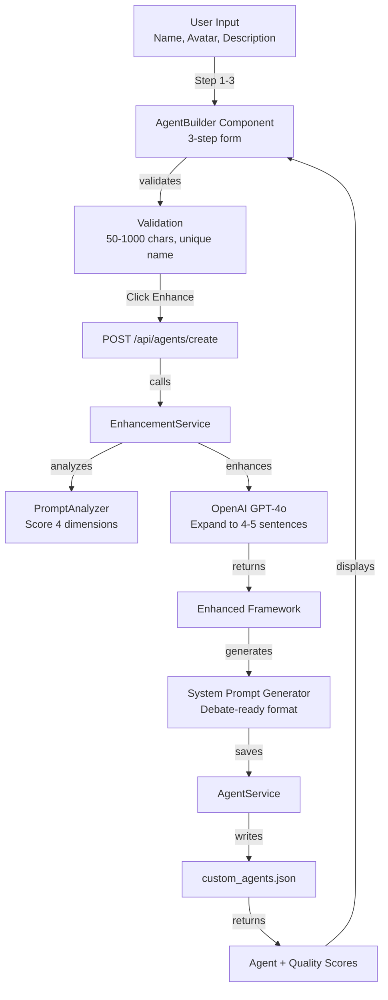
```mermaid
graph TD
    User[User Input<br/>Name, Avatar, Description]
    
    User -->|Step 1-3| AgentBuilder[AgentBuilder Component<br/>3-step form]
    AgentBuilder -->|validates| Validation[Validation<br/>50-1000 chars, unique name]
    Validation -->|Click Enhance| API[POST /api/agents/create]
    
    API -->|calls| EnhancementService[EnhancementService]
    EnhancementService -->|analyzes| Analyzer[PromptAnalyzer<br/>Score 4 dimensions]
    EnhancementService -->|enhances| GPT4o[OpenAI GPT-4o<br/>Expand to 4-5 sentences]
    
    GPT4o -->|returns| Enhanced[Enhanced Framework]
    Enhanced -->|generates| SystemPrompt[System Prompt Generator<br/>Debate-ready format]
    
    SystemPrompt -->|saves| AgentService[AgentService]
    AgentService -->|writes| Storage[custom_agents.json]
    
    Storage -->|returns| Response[Agent + Quality Scores]
    Response -->|displays| AgentBuilder
```

### 2.3 Data Flow - Agent Creation

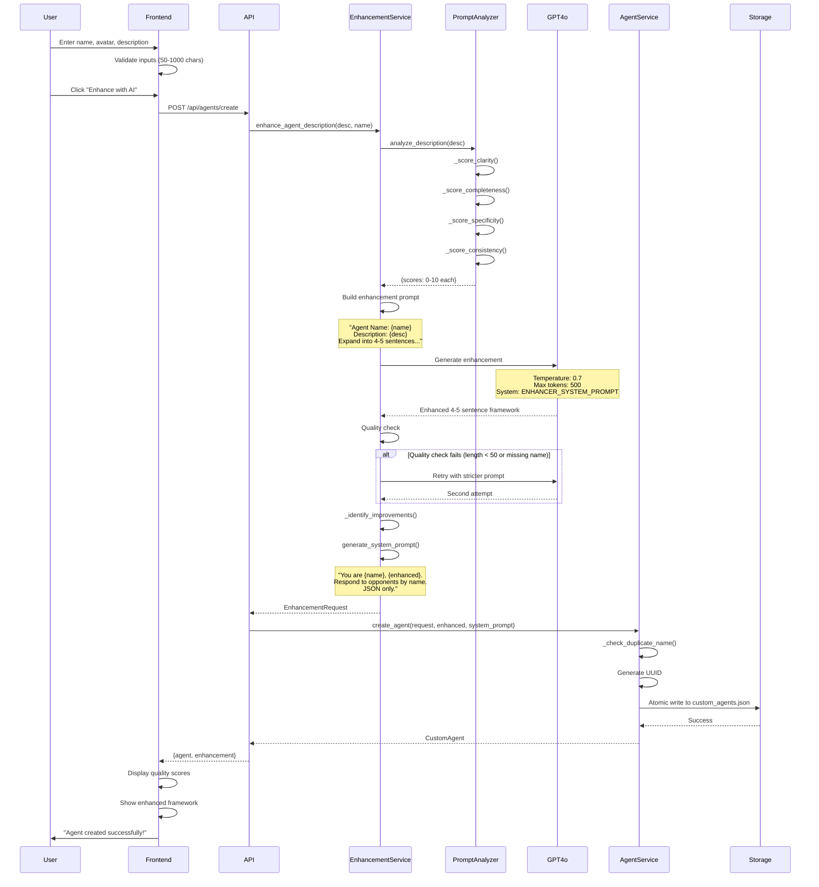
```mermaid
sequenceDiagram
    participant User
    participant Frontend
    participant API
    participant EnhancementService
    participant PromptAnalyzer
    participant GPT4o
    participant AgentService
    participant Storage
    
    User->>Frontend: Enter name, avatar, description
    Frontend->>Frontend: Validate inputs (50-1000 chars)
    User->>Frontend: Click "Enhance with AI"
    Frontend->>API: POST /api/agents/create
    
    API->>EnhancementService: enhance_agent_description(desc, name)
    
    EnhancementService->>PromptAnalyzer: analyze_description(desc)
    PromptAnalyzer->>PromptAnalyzer: _score_clarity()
    PromptAnalyzer->>PromptAnalyzer: _score_completeness()
    PromptAnalyzer->>PromptAnalyzer: _score_specificity()
    PromptAnalyzer->>PromptAnalyzer: _score_consistency()
    PromptAnalyzer-->>EnhancementService: {scores: 0-10 each}
    
    EnhancementService->>EnhancementService: Build enhancement prompt
    Note over EnhancementService: "Agent Name: {name}<br/>Description: {desc}<br/>Expand into 4-5 sentences..."
    
    EnhancementService->>GPT4o: Generate enhancement
    Note over GPT4o: Temperature: 0.7<br/>Max tokens: 500<br/>System: ENHANCER_SYSTEM_PROMPT
    GPT4o-->>EnhancementService: Enhanced 4-5 sentence framework
    
    EnhancementService->>EnhancementService: Quality check
    alt Quality check fails (length < 50 or missing name)
        EnhancementService->>GPT4o: Retry with stricter prompt
        GPT4o-->>EnhancementService: Second attempt
    end
    
    EnhancementService->>EnhancementService: _identify_improvements()
    EnhancementService->>EnhancementService: generate_system_prompt()
    Note over EnhancementService: "You are {name}, {enhanced}.<br/>Respond to opponents by name.<br/>JSON only."
    
    EnhancementService-->>API: EnhancementRequest
    
    API->>AgentService: create_agent(request, enhanced, system_prompt)
    AgentService->>AgentService: _check_duplicate_name()
    AgentService->>AgentService: Generate UUID
    AgentService->>Storage: Atomic write to custom_agents.json
    Storage-->>AgentService: Success
    AgentService-->>API: CustomAgent
    
    API-->>Frontend: {agent, enhancement}
    Frontend->>Frontend: Display quality scores
    Frontend->>Frontend: Show enhanced framework
    Frontend->>User: "Agent created successfully!"
```

### 2.4 Quality Scoring Algorithm

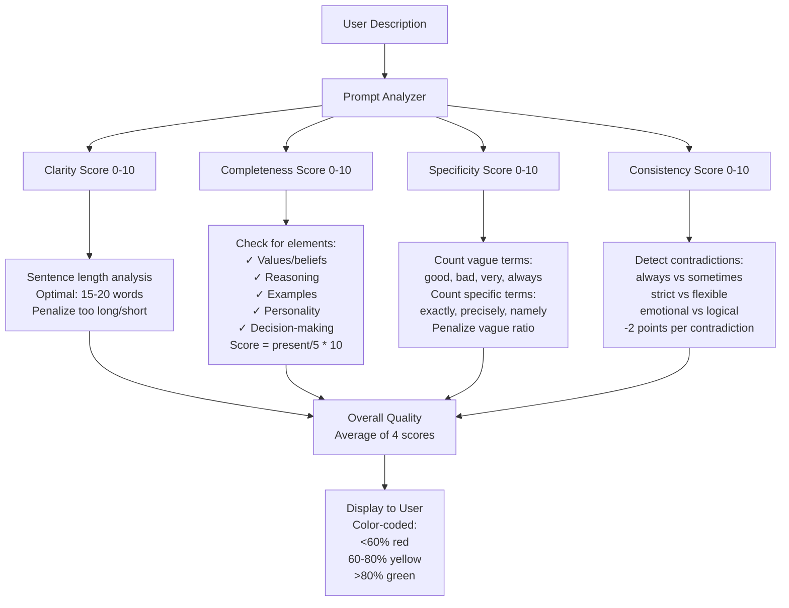
```mermaid
graph TD
    Description[User Description] --> Analyzer[Prompt Analyzer]
    
    Analyzer --> Clarity[Clarity Score 0-10]
    Analyzer --> Completeness[Completeness Score 0-10]
    Analyzer --> Specificity[Specificity Score 0-10]
    Analyzer --> Consistency[Consistency Score 0-10]
    
    Clarity --> ClarityLogic[Sentence length analysis<br/>Optimal: 15-20 words<br/>Penalize too long/short]
    
    Completeness --> CompletenessLogic[Check for elements:<br/>✓ Values/beliefs<br/>✓ Reasoning<br/>✓ Examples<br/>✓ Personality<br/>✓ Decision-making<br/>Score = present/5 * 10]
    
    Specificity --> SpecificityLogic[Count vague terms:<br/>good, bad, very, always<br/>Count specific terms:<br/>exactly, precisely, namely<br/>Penalize vague ratio]
    
    Consistency --> ConsistencyLogic[Detect contradictions:<br/>always vs sometimes<br/>strict vs flexible<br/>emotional vs logical<br/>-2 points per contradiction]
    
    ClarityLogic --> OverallScore[Overall Quality<br/>Average of 4 scores]
    CompletenessLogic --> OverallScore
    SpecificityLogic --> OverallScore
    ConsistencyLogic --> OverallScore
    
    OverallScore --> Display[Display to User<br/>Color-coded:<br/><60% red<br/>60-80% yellow<br/>>80% green]
```

---

## 3. Debate Library & Deduplication

**How It Works:**

**Step 1: Auto-Submit** - When debate starts, App.jsx calls checkAndAddToLibrary() in background (non-blocking). Builds {title, context, option_a, option_b}, POSTs to /api/debates/submit.

**Step 2: Validation** - DebateDeduplicationService validates required fields. If missing, returns error. Calls find_duplicate().

**Step 3: Embedding** - EmbeddingService creates 384-dim vector using hash-based approach: word hashing + char n-grams. For each word: hash(word) % 384, hash(reverse) % 384, hash(every other char) % 384. For each trigram: hash(trigram) % 384. Normalizes to unit length. Title excluded (only context/options matter).

**Step 4: Comparison** - Loads all templates from JSON. If empty, adds immediately. Otherwise: generates candidate embedding, loops through templates, computes cosine similarity, tracks best match.

**Step 5: Detection** - Threshold: 0.95 (exact/near-exact only). If best_similarity >= 0.95: duplicate found, returns match. If < 0.95: unique, proceeds to add.

**Step 6: Adding** - Generates ID (max + 1), creates URL-friendly slug (lowercase, remove special chars, limit 50 chars, ensure unique). Creates template with is_custom: true. Atomic write (temp file → rename).

**Step 7: Notification** - Frontend shows toast: success (green "✓ Added!") or duplicate (blue "ℹ Already exists"). Auto-clears after 4s. Debate continues regardless.

### 3.1 Class Diagram

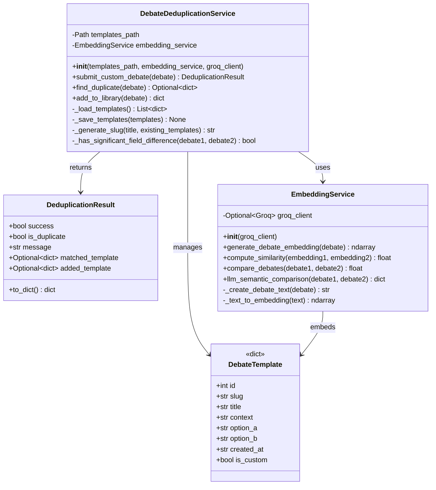
```mermaid
classDiagram
    class DeduplicationResult {
        +bool success
        +bool is_duplicate
        +str message
        +Optional~dict~ matched_template
        +Optional~dict~ added_template
        +to_dict() dict
    }
    
    class DebateDeduplicationService {
        -Path templates_path
        -EmbeddingService embedding_service
        +__init__(templates_path, embedding_service, groq_client)
        +submit_custom_debate(debate) DeduplicationResult
        +find_duplicate(debate) Optional~dict~
        +add_to_library(debate) dict
        -_load_templates() List~dict~
        -_save_templates(templates) None
        -_generate_slug(title, existing_templates) str
        -_has_significant_field_difference(debate1, debate2) bool
    }
    
    class EmbeddingService {
        -Optional~Groq~ groq_client
        +__init__(groq_client)
        +generate_debate_embedding(debate) ndarray
        +compute_similarity(embedding1, embedding2) float
        +compare_debates(debate1, debate2) float
        +llm_semantic_comparison(debate1, debate2) dict
        -_create_debate_text(debate) str
        -_text_to_embedding(text) ndarray
    }
    
    class DebateTemplate {
        <<dict>>
        +int id
        +str slug
        +str title
        +str context
        +str option_a
        +str option_b
        +str created_at
        +bool is_custom
    }
    
    DebateDeduplicationService --> EmbeddingService : uses
    DebateDeduplicationService --> DeduplicationResult : returns
    DebateDeduplicationService --> DebateTemplate : manages
    EmbeddingService --> DebateTemplate : embeds
```

### 3.2 Frontend Architecture

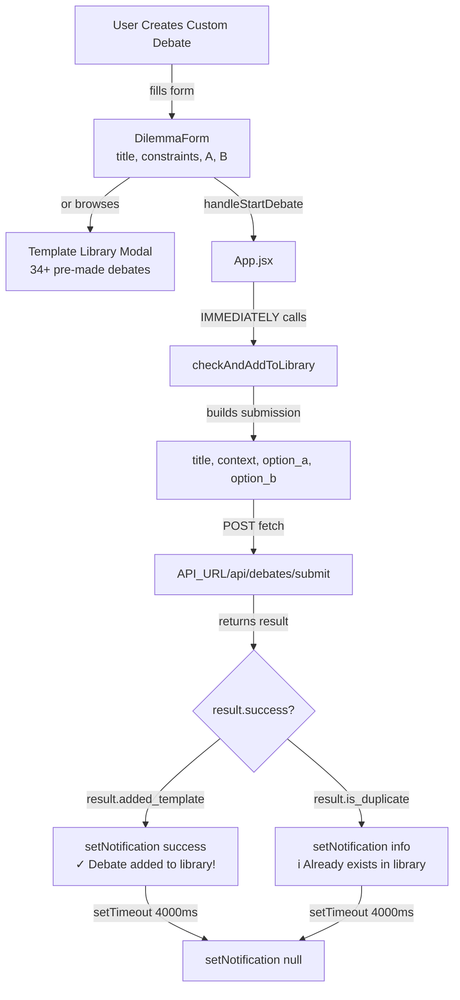
```mermaid
graph TD
    User[User Creates Custom Debate]
    
    User -->|fills form| DilemmaForm[DilemmaForm<br/>title, constraints, A, B]
    DilemmaForm -->|or browses| TemplateLibrary[Template Library Modal<br/>34+ pre-made debates]
    
    DilemmaForm -->|handleStartDebate| App[App.jsx]
    App -->|IMMEDIATELY calls| CheckDuplicate[checkAndAddToLibrary]
    
    CheckDuplicate -->|builds submission| Submission[title, context, option_a, option_b]
    Submission -->|POST fetch| API[API_URL/api/debates/submit]
    
    API -->|returns result| Response{result.success?}
    Response -->|result.added_template| SuccessNotif[setNotification success<br/>✓ Debate added to library!]
    Response -->|result.is_duplicate| DuplicateNotif[setNotification info<br/>ℹ Already exists in library]
    
    SuccessNotif -->|setTimeout 4000ms| ClearNotif[setNotification null]
    DuplicateNotif -->|setTimeout 4000ms| ClearNotif
```

### 3.3 Backend Architecture

```mermaid
graph TD
    API[POST /api/debates/submit]
    
    API -->|calls| Service[DebateDeduplicationService<br/>submit_custom_debate]
    Service -->|validates| Fields{Has title, context,<br/>option_a, option_b?}
    
    Fields -->|No| Error[Return error:<br/>Missing required fields]
    Fields -->|Yes| FindDup[find_duplicate]
    
    FindDup -->|loads| Templates[_load_templates<br/>from JSON]
    Templates -->|empty?| CheckEmpty{templates.length > 0?}
    CheckEmpty -->|No| AddNew[add_to_library]
    
    CheckEmpty -->|Yes| GenEmbed[generate_debate_embedding<br/>candidate]
    GenEmbed -->|creates| CandidateVec[384-dim vector<br/>word + char n-grams]
    
    CandidateVec -->|loop templates| CompareLoop[For each template]
    CompareLoop -->|generate| TemplateEmbed[template embedding]
    CompareLoop -->|compute| Similarity[cosine_similarity]
    
    Similarity -->|track| BestMatch[best_match, best_similarity]
    BestMatch -->|check| Threshold{similarity >= 0.95?}
    
    Threshold -->|Yes| ReturnDup[Return DeduplicationResult<br/>is_duplicate=True]
    Threshold -->|No| AddNew
    
    AddNew -->|generate| NewID[max_id + 1]
    AddNew -->|generate| Slug[_generate_slug from title]
    AddNew -->|create| Template[New template object]
    Template -->|atomic write| Save[_save_templates<br/>temp file + rename]
    
    Save -->|return| ReturnSuccess[Return DeduplicationResult<br/>success=True, added_template]
---

## 4. Judge System

**How It Works:**

**Step 1: Request** - User clicks "Get Verdict". App.jsx sets stage='judging', POSTs /judge with transcript.

**Step 2: Prompt** - Backend validates transcript has turns. Builds judge prompt: summarizes dilemma, extracts all arguments by round.

**Step 3: Analysis** - Calls Groq with JUDGE_SYS prompt (temp 0.3, max_tokens 800, Llama 3.3 70B). Requests JSON with final_recommendation, confidence, 5-dimensional scores (autonomy, harm_prevention, fairness, transparency, long_term_impact), reasoning, key_considerations.

**Step 4: Parsing** - clamp_json() parses with 4-level fallback. Validates structure. Retries with stricter prompt if validation fails.

**Step 5: Metrics** - MetricsService calculates: total turns/words, per-agent stats, stance changes, most verbose agent, intensity score. Saves to debate_metrics.json.

**Step 6: Storage** - DebateHistoryService generates UUID, stores transcript + verdict with metadata. Inserts at beginning (most recent first). Keeps last 100 debates. Saves to debate_history.json.

**Step 7: Display** - Returns {verdict, metrics}. App.jsx sets verdict, stage='verdict'. VerdictView renders recommendation, confidence, 5 ethical scores with bars, reasoning, key considerations, "Export to PDF" button.

### 4.1 Class Diagram

```mermaid
classDiagram
    class JudgeRequest {
        <<Pydantic BaseModel>>
        +dict transcript
        +validate_transcript() dict
    }
    
    class EthicalScores {
        <<dict>>
        +float autonomy
        +float harm_prevention
        +float fairness
        +float transparency
        +float long_term_impact
    }
    
    class Verdict {
        <<dict>>
        +str final_recommendation
        +float confidence
        +EthicalScores scores
        +str reasoning
        +List~str~ key_considerations
    }
    
    class JudgeSystem {
        <<main.py functions>>
        +str JUDGE_SYS
        +judge_debate(transcript) Verdict
        +call_ollama(system_prompt, user_prompt) str
        +clamp_json(response, fallback) dict
        -_build_judge_prompt(transcript) str
        -_parse_verdict(response) Verdict
    }
    
    JudgeSystem --> JudgeRequest : receives
    JudgeSystem --> Verdict : returns
    Verdict --> EthicalScores : contains
```

### 4.2 Data Flow - Verdict Generation

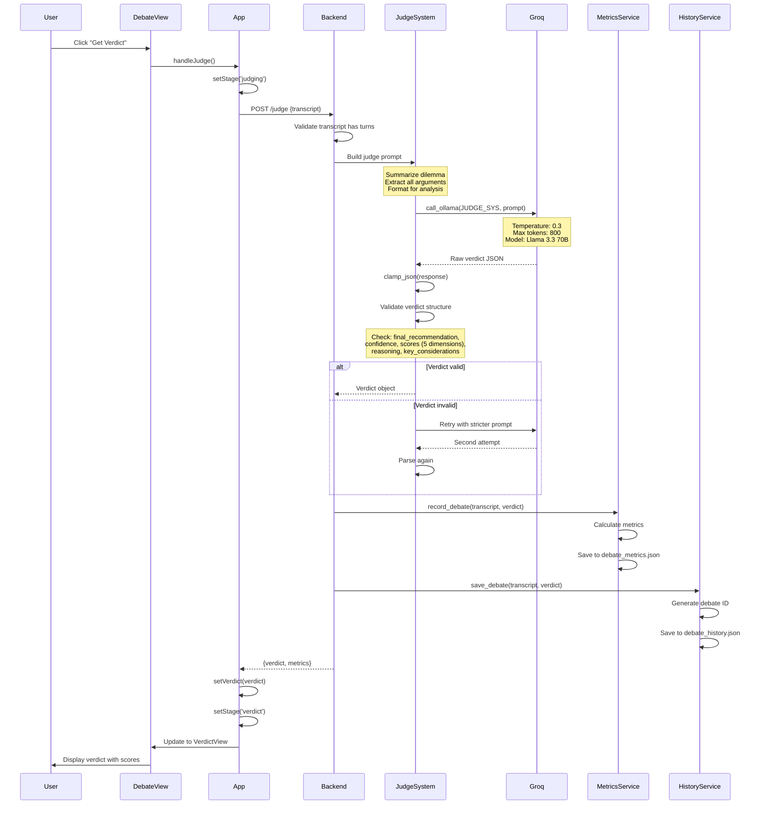
```mermaid
sequenceDiagram
    participant User
    participant DebateView
    participant App
    participant Backend
    participant JudgeSystem
    participant Groq
    participant MetricsService
    participant HistoryService
    
    User->>DebateView: Click "Get Verdict"
    DebateView->>App: handleJudge()
    App->>App: setStage('judging')
    
    App->>Backend: POST /judge {transcript}
    Backend->>Backend: Validate transcript has turns
    
    Backend->>JudgeSystem: Build judge prompt
    Note over JudgeSystem: Summarize dilemma<br/>Extract all arguments<br/>Format for analysis
    
    JudgeSystem->>Groq: call_ollama(JUDGE_SYS, prompt)
    Note over Groq: Temperature: 0.3<br/>Max tokens: 800<br/>Model: Llama 3.3 70B
    
    Groq-->>JudgeSystem: Raw verdict JSON
    JudgeSystem->>JudgeSystem: clamp_json(response)
    
    JudgeSystem->>JudgeSystem: Validate verdict structure
    Note over JudgeSystem: Check: final_recommendation,<br/>confidence, scores (5 dimensions),<br/>reasoning, key_considerations
    
    alt Verdict valid
        JudgeSystem-->>Backend: Verdict object
    else Verdict invalid
        JudgeSystem->>Groq: Retry with stricter prompt
        Groq-->>JudgeSystem: Second attempt
        JudgeSystem->>JudgeSystem: Parse again
    end
    
    Backend->>MetricsService: record_debate(transcript, verdict)
    MetricsService->>MetricsService: Calculate metrics
    MetricsService->>MetricsService: Save to debate_metrics.json
    
    Backend->>HistoryService: save_debate(transcript, verdict)
    HistoryService->>HistoryService: Generate debate ID
    HistoryService->>HistoryService: Save to debate_history.json
    
    Backend-->>App: {verdict, metrics}
    App->>App: setVerdict(verdict)
    App->>App: setStage('verdict')
    App->>DebateView: Update to VerdictView
    DebateView->>User: Display verdict with scores
```

---

## 5. Analytics Dashboard

**How It Works:**

**Step 1: Collection** - MetricsService auto-records after every verdict. Stores in debate_metrics.json: metadata (ID, timestamp, title), participation (agents, turns, words), performance (verbosity, stance changes, intensity), outcome (recommendation, confidence, ethical scores).

**Step 2: Calculation** - calculate_debate_metrics() processes each debate: counts turns/words, calculates per-agent stats, tracks stance changes, identifies most verbose agent, computes intensity (avg words/turn), extracts verdict data.

**Step 3: Aggregation** - get_summary_stats() aggregates all debates: total debates/words/turns, averages, most common winner, agent usage stats, most used agent.

**Step 4: Display** - Dashboard fetches via GET /api/metrics. Renders: total debates counter, average stats, agent usage charts, win rate distribution, recent history, trend analysis.

### 5.1 Class Diagram

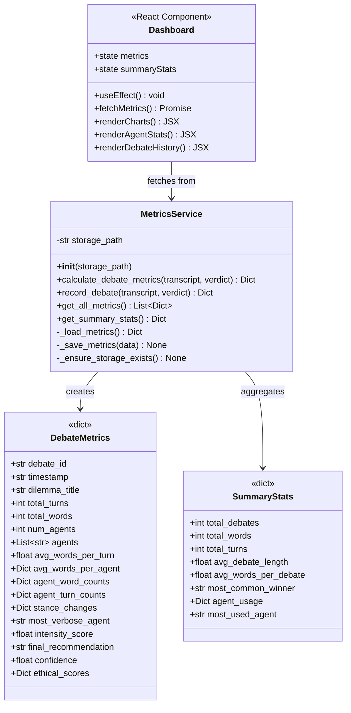
```mermaid
classDiagram
    class MetricsService {
        -str storage_path
        +__init__(storage_path)
        +calculate_debate_metrics(transcript, verdict) Dict
        +record_debate(transcript, verdict) Dict
        +get_all_metrics() List~Dict~
        +get_summary_stats() Dict
        -_load_metrics() Dict
        -_save_metrics(data) None
        -_ensure_storage_exists() None
    }
    
    class DebateMetrics {
        <<dict>>
        +str debate_id
        +str timestamp
        +str dilemma_title
        +int total_turns
        +int total_words
        +int num_agents
        +List~str~ agents
        +float avg_words_per_turn
        +Dict avg_words_per_agent
        +Dict agent_word_counts
        +Dict agent_turn_counts
        +Dict stance_changes
        +str most_verbose_agent
        +float intensity_score
        +str final_recommendation
        +float confidence
        +Dict ethical_scores
    }
    
    class SummaryStats {
        <<dict>>
        +int total_debates
        +int total_words
        +int total_turns
        +float avg_debate_length
        +float avg_words_per_debate
        +str most_common_winner
        +Dict agent_usage
        +str most_used_agent
    }
    
    class Dashboard {
        <<React Component>>
        +state metrics
        +state summaryStats
        +useEffect() void
        +fetchMetrics() Promise
        +renderCharts() JSX
        +renderAgentStats() JSX
        +renderDebateHistory() JSX
    }
    
    MetricsService --> DebateMetrics : creates
    MetricsService --> SummaryStats : aggregates
    Dashboard --> MetricsService : fetches from
```

---

## 6. Debate History & Replay

**How It Works:**

**Step 1: Auto-Save** - After every verdict, DebateHistoryService.save_debate() creates entry: UUID, title, date/timestamp, complete transcript, full verdict. Inserts at beginning (most recent first). Limits to last 100. Saves to debate_history.json with atomic write.

**Step 2: Browse** - User opens DebateLibrary. Fetches via GET /api/history?limit=50. Displays list with title, date, recommendation, confidence, preview.

**Step 3: Select** - User clicks debate → GET /api/history/{debate_id}. Returns complete data (transcript + verdict).

**Step 4: Replay** - DebateLibrary calls App.loadDebate(transcript, verdict). App.jsx sets transcript, verdict, stage='verdict'. DebateView renders full transcript. VerdictView shows original verdict. No AI calls needed.

**Step 5: Management** - Delete via DELETE /api/history/{debate_id}. Removes entry, updates JSON, deletes associated ratings. get_stats() provides overview.

### 6.1 Class Diagram

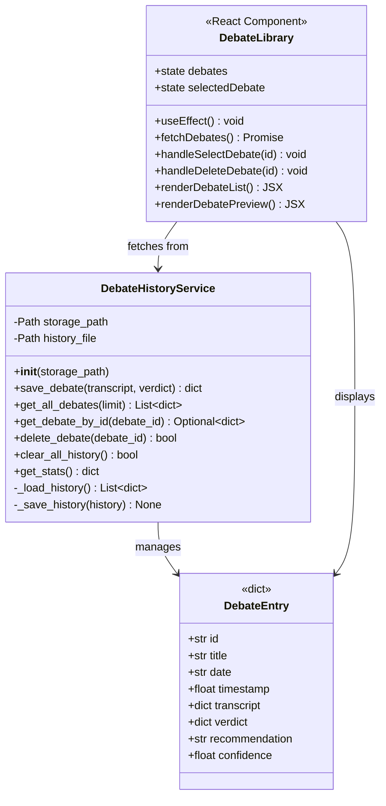
```mermaid
classDiagram
    class DebateHistoryService {
        -Path storage_path
        -Path history_file
        +__init__(storage_path)
        +save_debate(transcript, verdict) dict
        +get_all_debates(limit) List~dict~
        +get_debate_by_id(debate_id) Optional~dict~
        +delete_debate(debate_id) bool
        +clear_all_history() bool
        +get_stats() dict
        -_load_history() List~dict~
        -_save_history(history) None
    }
    
    class DebateEntry {
        <<dict>>
        +str id
        +str title
        +str date
        +float timestamp
        +dict transcript
        +dict verdict
        +str recommendation
        +float confidence
    }
    
    class DebateLibrary {
        <<React Component>>
        +state debates
        +state selectedDebate
        +useEffect() void
        +fetchDebates() Promise
        +handleSelectDebate(id) void
        +handleDeleteDebate(id) void
        +renderDebateList() JSX
        +renderDebatePreview() JSX
    }
    
    DebateHistoryService --> DebateEntry : manages
    DebateLibrary --> DebateHistoryService : fetches from
    DebateLibrary --> DebateEntry : displays
```

### 6.2 Data Flow - Replay Debate

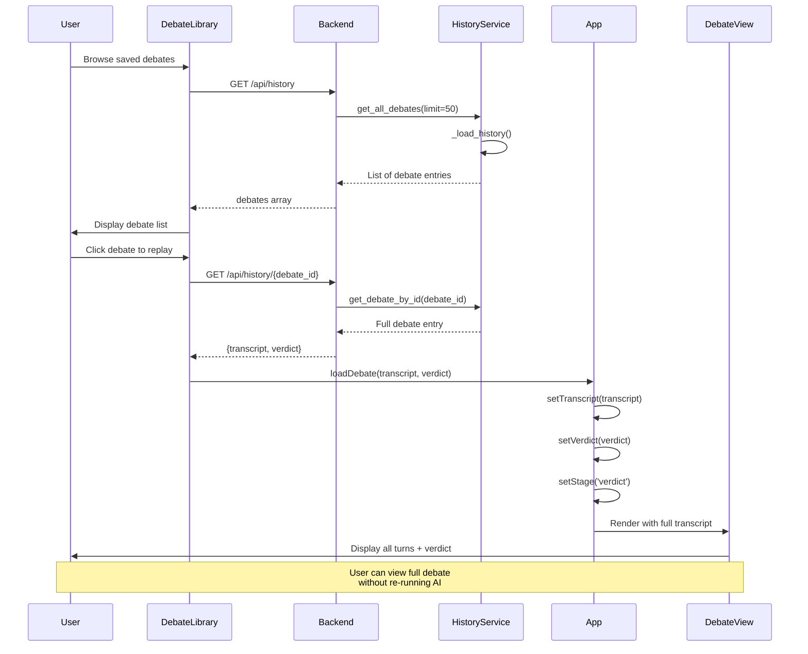
```mermaid
sequenceDiagram
    participant User
    participant DebateLibrary
    participant Backend
    participant HistoryService
    participant App
    participant DebateView
    
    User->>DebateLibrary: Browse saved debates
    DebateLibrary->>Backend: GET /api/history
    Backend->>HistoryService: get_all_debates(limit=50)
    HistoryService->>HistoryService: _load_history()
    HistoryService-->>Backend: List of debate entries
    Backend-->>DebateLibrary: debates array
    
    DebateLibrary->>User: Display debate list
    User->>DebateLibrary: Click debate to replay
    
    DebateLibrary->>Backend: GET /api/history/{debate_id}
    Backend->>HistoryService: get_debate_by_id(debate_id)
    HistoryService-->>Backend: Full debate entry
    Backend-->>DebateLibrary: {transcript, verdict}
    
    DebateLibrary->>App: loadDebate(transcript, verdict)
    App->>App: setTranscript(transcript)
    App->>App: setVerdict(verdict)
    App->>App: setStage('verdict')
    
    App->>DebateView: Render with full transcript
    DebateView->>User: Display all turns + verdict
    
    Note over User,DebateView: User can view full debate<br/>without re-running AI
```

---

## 7. PDF Export

**How It Works:**

**Step 1: Trigger** - User clicks "Export to PDF" in VerdictView. Calls PDFExporter.exportDebateToPDF(transcript, verdict).

**Step 2: Initialize** - Creates jsPDF instance (A4, portrait). Sets font: Helvetica. Initializes margins.

**Step 3: Header** - _addHeader() adds: title "MirrorMind AI - Ethical Debate", debate title, date, participating agents. Font: 16pt title, 12pt metadata.

**Step 4: Dilemma** - _addDilemma() formats: section header, context (word-wrapped), Option A, Option B. Uses _formatText() to wrap text (max 170mm width).

**Step 5: Rounds** - _addDebateRounds() processes turns: round headers, agent name + stance badge, argument (wrapped, indented). Checks page space, calls addPage() if full.

**Step 6: Verdict** - _addVerdict() includes: section header, recommendation, confidence %, reasoning, key considerations as bullets.

**Step 7: Scores** - _addScores() displays 5 dimensions: Autonomy, Harm Prevention, Fairness, Transparency, Long-term Impact (0-10 each).

**Step 8: Finalize** - _addPageNumbers() adds "Page X of Y". Generates filename: "debate-{title}-{date}.pdf". Calls save() to trigger download.

### 7.1 Class Diagram

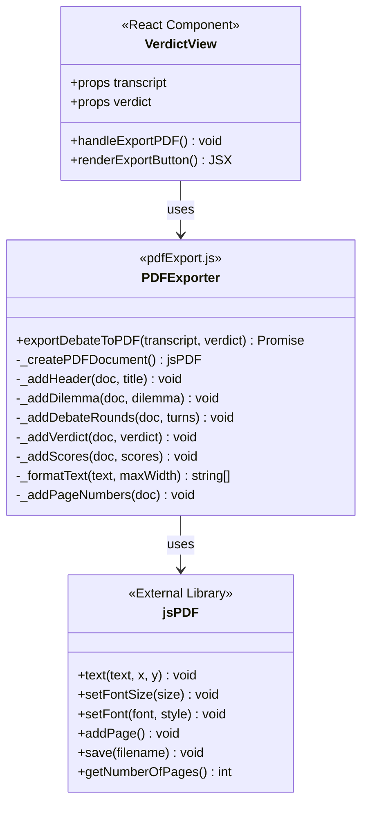
```mermaid
classDiagram
    class PDFExporter {
        <<pdfExport.js>>
        +exportDebateToPDF(transcript, verdict) Promise
        -_createPDFDocument() jsPDF
        -_addHeader(doc, title) void
        -_addDilemma(doc, dilemma) void
        -_addDebateRounds(doc, turns) void
        -_addVerdict(doc, verdict) void
        -_addScores(doc, scores) void
        -_formatText(text, maxWidth) string[]
        -_addPageNumbers(doc) void
    }
    
    class VerdictView {
        <<React Component>>
        +props transcript
        +props verdict
        +handleExportPDF() void
        +renderExportButton() JSX
    }
    
    class jsPDF {
        <<External Library>>
        +text(text, x, y) void
        +setFontSize(size) void
        +setFont(font, style) void
        +addPage() void
        +save(filename) void
        +getNumberOfPages() int
    }
    
    VerdictView --> PDFExporter : uses
    PDFExporter --> jsPDF : uses
```

### 7.2 Data Flow - PDF Generation

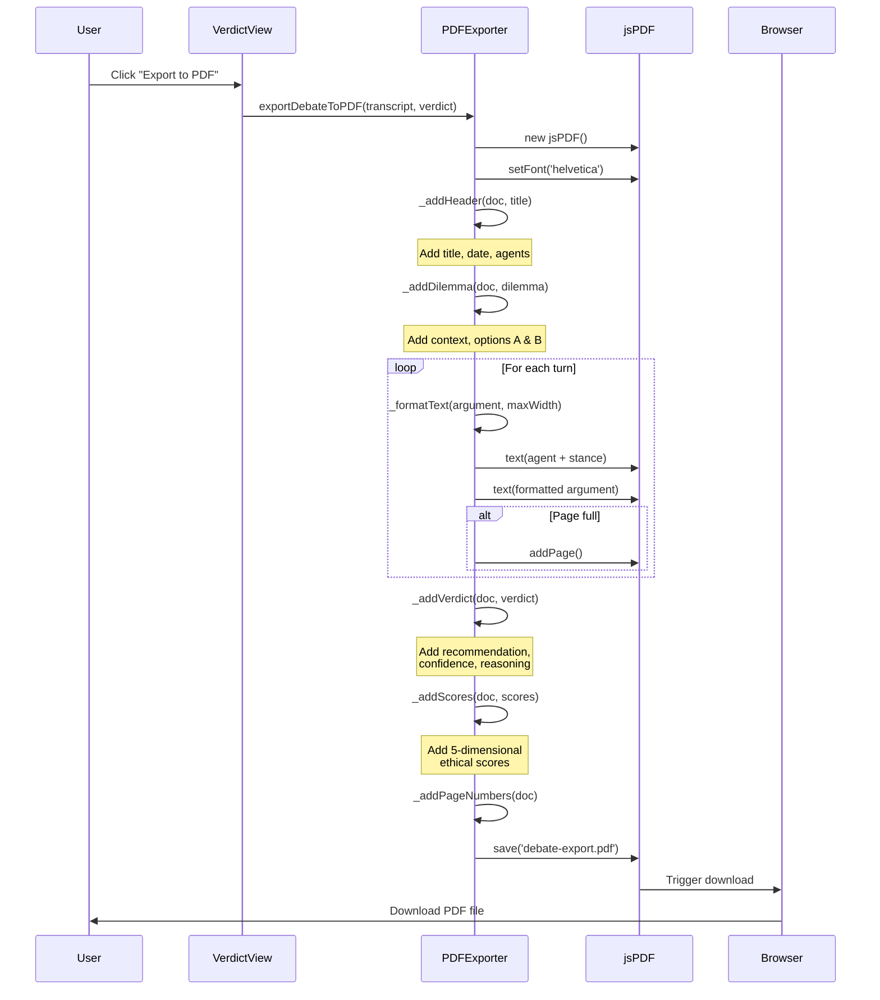
```mermaid
sequenceDiagram
    participant User
    participant VerdictView
    participant PDFExporter
    participant jsPDF
    participant Browser
    
    User->>VerdictView: Click "Export to PDF"
    VerdictView->>PDFExporter: exportDebateToPDF(transcript, verdict)
    
    PDFExporter->>jsPDF: new jsPDF()
    PDFExporter->>jsPDF: setFont('helvetica')
    
    PDFExporter->>PDFExporter: _addHeader(doc, title)
    Note over PDFExporter: Add title, date, agents
    
    PDFExporter->>PDFExporter: _addDilemma(doc, dilemma)
    Note over PDFExporter: Add context, options A & B
    
    loop For each turn
        PDFExporter->>PDFExporter: _formatText(argument, maxWidth)
        PDFExporter->>jsPDF: text(agent + stance)
        PDFExporter->>jsPDF: text(formatted argument)
        
        alt Page full
            PDFExporter->>jsPDF: addPage()
        end
    end
    
    PDFExporter->>PDFExporter: _addVerdict(doc, verdict)
    Note over PDFExporter: Add recommendation,<br/>confidence, reasoning
    
    PDFExporter->>PDFExporter: _addScores(doc, scores)
    Note over PDFExporter: Add 5-dimensional<br/>ethical scores
    
    PDFExporter->>PDFExporter: _addPageNumbers(doc)
    
    PDFExporter->>jsPDF: save('debate-export.pdf')
    jsPDF->>Browser: Trigger download
    Browser->>User: Download PDF file
```
