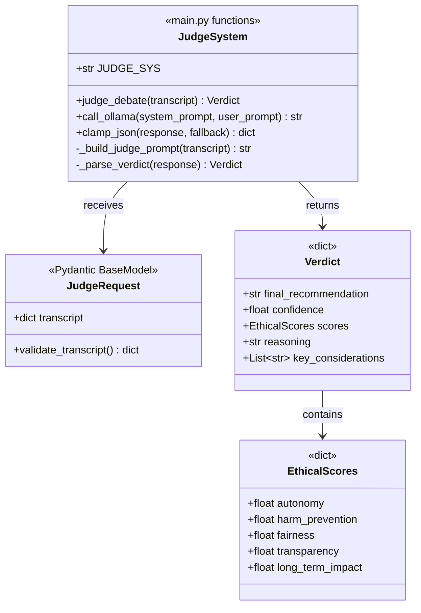

# MirrorMind AI - Feature Architecture Diagrams

**Complete architecture and data flow diagrams based on actual code implementation**

---

## Table of Contents

1. [AI Debate Arena](#1-ai-debate-arena)
2. [Custom Agent Builder](#2-custom-agent-builder)
3. [Debate Library & Deduplication](#3-debate-library--deduplication)
4. [Judge System](#4-judge-system)
5. [Analytics Dashboard](#5-analytics-dashboard)
6. [Debate History & Replay](#6-debate-history--replay)
7. [PDF Export](#7-pdf-export)

---

## 1. AI Debate Arena

### 1.1 Class Diagram


### 1.2 Component Architecture (Frontend)


### 1.3 System Architecture (Full Stack)


### 1.4 Data Flow - Opening Arguments


### 1.5 Data Flow - Rebuttal Round


### 1.6 Component Architecture


---

## 2. Custom Agent Builder

### 2.1 Class Diagram


### 2.2 System Architecture


### 2.3 Data Flow - Agent Creation


### 2.4 Quality Scoring Algorithm


---

## 3. Debate Library & Deduplication

### 3.1 Class Diagram


### 3.2 Frontend Architecture


### 3.3 Backend Architecture


## 4. Judge System

### 4.1 Class Diagram



### 4.2 Data Flow - Verdict Generation


---

## 5. Analytics Dashboard

### 5.1 Class Diagram


---

## 6. Debate History & Replay

### 6.1 Class Diagram


### 6.2 Data Flow - Replay Debate


---

## 7. PDF Export

### 7.1 Class Diagram


### 7.2 Data Flow - PDF Generation


---

## 8. Core Backend Classes

### 8.1 Main API Class Diagram

```mermaid
classDiagram
    class FastAPIApp {
        <<FastAPI>>
        +CORSMiddleware cors
        +post_openings()
        +post_continue()
        +post_judge()
        +post_agent_by_name()
        +get_agents()
        +post_agents_create()
        +post_debates_submit()
        +get_history()
    }
    
    class DilemmaRequest {
        <<Pydantic BaseModel>>
        +str title
        +str A
        +str B
        +str constraints
    }
    
    class AgentTurn {
        <<dict>>
        +str agent
        +str stance
        +str argument
    }
    
    class Transcript {
        <<dict>>
        +dict dilemma
        +List~AgentTurn~ turns
    }
    
    class AIProvider {
        <<main.py>>
        +str AI_PROVIDER
        +Groq groq_client
        +call_ollama(sys, user, temp, tokens) str
        +clamp_json(response, fallback) dict
    }
    
    class PromptTemplates {
        <<main.py constants>>
        +str DEON_SYS
        +str CONSE_SYS
        +str VIRTUE_SYS
        +str JUDGE_SYS
        +str OPENING_INSTRUCT
        +str CONTINUE_INSTRUCT
    }
    
    FastAPIApp --> DilemmaRequest : receives
    FastAPIApp --> Transcript : manages
    FastAPIApp --> AIProvider : uses
    FastAPIApp --> AgentService : uses
    FastAPIApp --> EnhancementService : uses
    FastAPIApp --> DebateDeduplicationService : uses
    FastAPIApp --> MetricsService : uses
    FastAPIApp --> DebateHistoryService : uses
    
    AIProvider --> PromptTemplates : uses
    Transcript --> AgentTurn : contains
```
